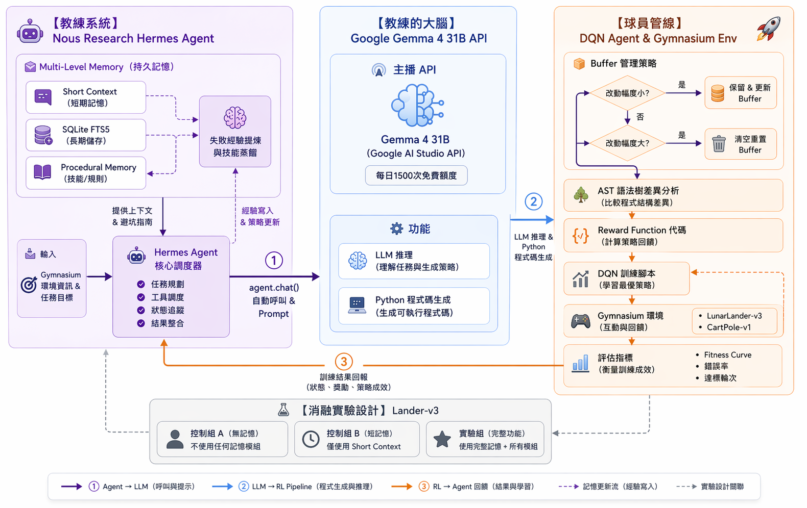

# Hermes-DQN

> **Memory-Augmented LLM Framework for Automated Reinforcement Learning Reward Design**
> *(Hermes-DQN：用於自動化強化學習獎勵函數設計的記憶擴增大型語言模型框架)*

一句話說明：**用具備長期記憶的開源 LLM 當「教練」，自動為 DQN 設計獎勵函數**，
透過 AST 感知的緩衝區管理與 Fitness 回饋閉環，逐步逼近高品質、穩定可用的 reward function，
大幅降低人工試錯成本並擺脫對商業 API 的依賴。

---

## 📊 為什麼要做這個研究 —— 數據說話

DRL 落地時最大的痛點是**獎勵函數設計**：獎勵稀疏、人工難調、訓練不穩定。
2025–2026 的最新文獻讓這個問題的輪廓變得非常清楚，也揭露了現有解法的缺口：

| 問題 | 關鍵數據 | 文獻來源 |
| --- | --- | --- |
| 稀疏獎勵是 DRL 核心難題 | 被列為 2025 年 RL 課程 3 大開放挑戰之一 | Stanford CS224R 2025、DISCOVER @ NeurIPS 2025 |
| LLM 寫 reward 已被驗證可行 | **83% 任務勝過人類專家、平均提升 52%** | EUREKA, ICLR 2024 |
| 但 EUREKA 類方法綁死商業 API | 成本高、無法離線、不可重現 | LEARN-Opt (Nov 2025)、CARD (KBS 2025) |
| 開源模型已足以取代 | Gemma 4 31B：LiveCodeBench **29.1% → 80.0%**、Codeforces ELO **2150** | Google DeepMind 2026 |
| LLM 智能體普遍缺乏跨輪記憶 | OSWorld 引入記憶後 **12% → 66.3%** | Stanford HAI AI Index 2026 |
| 記憶機制對 RL 有正面效益 | 選擇性記憶 **+10% 性能**、20+ 技能代理 **加速 40%** | Systematic Study (May 2025)、Nous Hermes Agent 2026 |
| LLM 可直接幫助 DQN 探索 | Atari/MuJoCo 性能提升 **最高 +37.27%** | LLM-Explorer, NeurIPS 2025 |
| DQN 面對動態獎勵會災難性遺忘 | Bellman 運算子漂移、Churn Chain 效應 | GB-DQN (arXiv Dec 2025)、NeurIPS 2024 |
| LunarLander 標準基準 | DQN 約 **1200 episodes 收斂、成功率 92%** | IJRPR 2025 |

**結論**：LLM 寫 reward 的可行性已經被證明（EUREKA），但現有工作同時綁定商業 API、缺乏長期記憶、
且沒有處理「reward 改變時 DQN replay buffer 失效」的問題。
這三個缺口正是 Hermes-DQN 要填的空格。

---

## 🎯 三大核心貢獻

1. **開源化**：以 Google Gemma 4 31B 取代 GPT-4 類商業 API，驗證開源模型已足以承擔 reward 生成任務
2. **記憶擴增**：整合 Nous Research Hermes Agent 的四層記憶架構（Short Context / Working / SQLite FTS5 / Procedural Memory），讓教練 LLM 在多輪迭代中累積「成功 / 失敗樣本」
3. **AST 感知緩衝區**：在 reward 函數變動時，用 AST 分析判斷應保留 / 拋棄 / 權重衰減哪些 replay 樣本，避開 DQN 的災難性遺忘

---

## 📺 系統介紹影片

[](https://youtu.be/b4ad_7xtydk)

> 🎥 若縮圖無法顯示，可直接開啟 <https://youtu.be/b4ad_7xtydk>

---

## 🏗️ 系統架構



### 三大子系統（對應架構圖的三個區塊）

#### 1️⃣ 教授系統 — Nous Research Hermes Agent

擔任「教練」角色，負責調度整個迭代流程與記憶管理。

| 元件 | 作用 |
| --- | --- |
| **Multi-Level Memory** | 四層記憶協同工作，保留跨輪次的 reward 迭代經驗 |
| ├─ Short Context | 本輪對話與 prompt 工作區 |
| ├─ Working Memory | 當前 session 的暫存推理鏈 |
| ├─ SQLite FTS5 | 長期結構化紀錄：成功 / 失敗 reward 函數與對應 Fitness |
| └─ Procedural Memory | 固化的操作流程與經驗法則 |
| **agent.chat() Prompt** | 組裝記憶檢索結果 + 任務目標，送給 Gemma 大腦 |

#### 2️⃣ 教授的大腦 — Google Gemma 4 31B API

實際執行 LLM 推理的核心。

| 元件 | 作用 |
| --- | --- |
| **Gemma 4 31B (Google AI Studio API)** | 主體 LLM，負責 reward 函數設計邏輯推理 |
| **LLM 推理** | 依 Hermes 傳入的 prompt 產出思路 |
| **Python 程式碼生成** | 產出可執行的獎勵函數原始碼 |

#### 3️⃣ 球員管理 — DQN Agent & Gymnasium Env

執行實際強化學習訓練並回傳成效。

| 元件 | 作用 |
| --- | --- |
| **AST 管理器** | 靜態分析新 reward 函數，與上一版比對差異類型 |
| **Buffer 管理器** | 依 AST 結果決定 replay buffer 的處理：保留 / 衰減 / 清空 |
| **前向相容性檢查** | 確保新 reward 不破壞過去經驗的可用性 |
| **DQN 模型訓練** | 標準 DQN 訓練迴圈 |
| **Gymnasium 環境** | LunarLander-v3 / CartPole-v1 等標準基準 |
| **Fitness 評估** | 以收斂輪次、平均 reward、成功率等指標量化本輪 reward 函數品質 |

### 資料流（閉環 7 步驟）

```
① Hermes Agent 依記憶組 prompt → 呼叫 Gemma
② Gemma 產出 Python reward 函數
③ AST 管理器分析新舊 reward 差異
④ Buffer 管理器依差異類型處理 replay buffer
⑤ DQN 在 Gymnasium 環境中以新 reward 訓練
⑥ Fitness 評估輸出量化指標
⑦ 結果寫回 Hermes 的 SQLite FTS5 長期記憶 → 回到 ①
```

整個迴圈讓「教練」會越教越準，而「球員」不會因 reward 變動而被過期經驗拖垮。

---

## 📁 專案目錄

| 路徑 | 內容 | 何時使用 |
| --- | --- | --- |
| `PPT/` | 期末報告簡報 v1 / v2、YouTube 口白稿 | 口頭報告、錄影 |
| `docx/` | 論文 v1 / v2（PDF + DOCX）、相關研究與支持數據整理 | 撰寫 / 修改論文 |
| `images/` | `第二版架構圖.png`（最新系統架構圖） | README 與簡報引用 |
| `aichat_record/` | 與 Claude / Gemini / NotebookLM 的研究對話紀錄 | 追溯設計脈絡 |
| `openspec/` | OpenSpec 變更管理：`changes/`、`specs/`、`archive/` | 新增功能前先寫 proposal |
| `01-startup.sh` / `02-ending.sh` | 每日工作階段自動化腳本 | 由 `npm run dev:*` 呼叫 |
| `CLAUDE.md` | 專案開發守則與工作流程 | 協作時參考 |

### 檔案版本命名

所有可迭代產物（簡報、論文、架構圖）一律使用「**第 N 版**」中文後綴，最新以數字最大者為準：
- `PPT_第二版.pdf`、`文件第二版.docx`、`第二版架構圖.png`

---

## 🛠️ 開發工作流程

### 每日指令

```bash
npm run dev:start    # git pull → 載入最新 handover → 顯示下一步
npm run dev:ending   # 更新 tasks.md → 寫新 handover → commit & push
```

### OpenSpec 變更管理

```
/opsx:explore    探索現況
/opsx:propose    建立 proposal + design + specs + tasks
/opsx:apply      依 tasks.md 逐項實作
/opsx:archive    完成後歸檔
```

### 編號規則

所有 handover / change / 序號檔一律 `NN-` 兩位數前綴，不得跳號、重用、重置。
完整規範見 [`openspec/specs/numbering-rule/spec.md`](openspec/specs/numbering-rule/spec.md)。

---

## 🔗 連結

- **GitHub**：<https://github.com/oomao/Final_project_Group5_DRL>
- **影片**：<https://youtu.be/b4ad_7xtydk>
- **分支**：`main`
