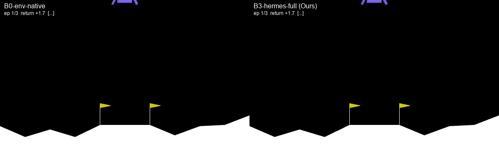
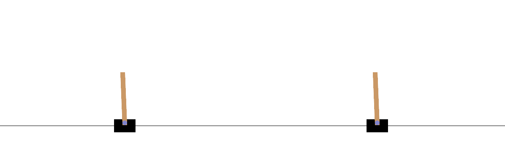
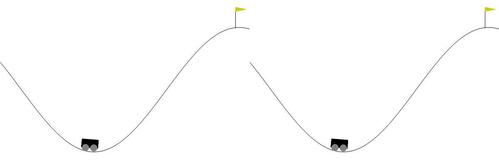
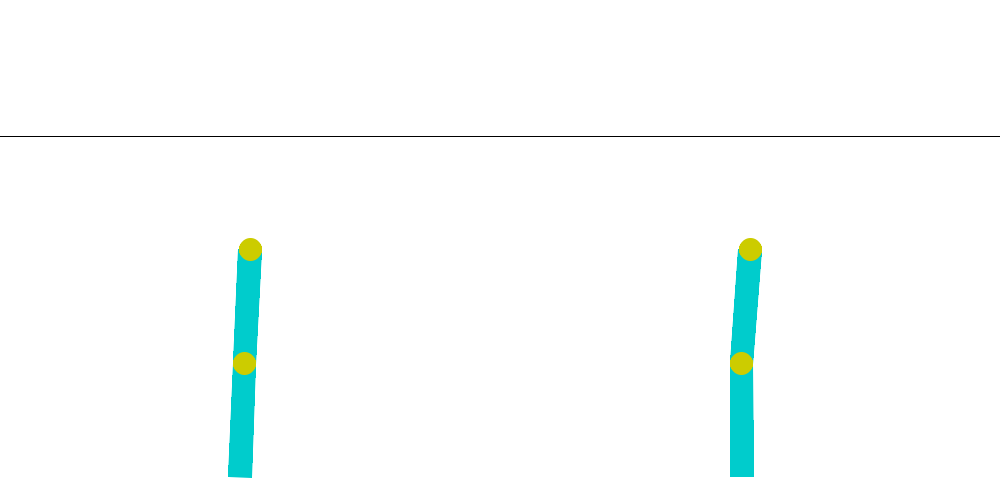
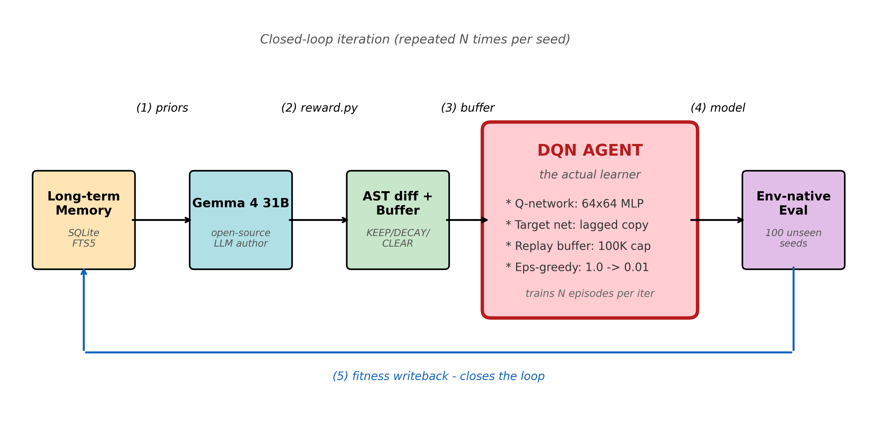

# Hermes-DQN

> **Memory-Augmented LLM Framework for Automated Reinforcement Learning Reward Design**
> *(Hermes-DQN：用於自動化強化學習獎勵函數設計的記憶擴增大型語言模型框架)*

一句話說明：**用具備長期記憶的開源 LLM 當「教練」，自動為 DQN 設計獎勵函數**，
透過 AST 感知的緩衝區管理與 Fitness 回饋閉環，逐步逼近高品質、穩定可用的 reward function，
大幅降低人工試錯成本並擺脫對商業 API 的依賴。

---

## 📊 為什麼要做這個研究 —— 數據說話

DRL 落地時最大的痛點是**獎勵函數設計**：獎勵稀疏、人工難調、訓練不穩定。
2025–2026 的最新文獻讓這個問題的輪廓變得非常清楚，也揭露了現有解法的缺口：

| 問題 | 關鍵數據 | 文獻來源 |
| --- | --- | --- |
| 稀疏獎勵是 DRL 核心難題 | 被列為 2025 年 RL 課程 3 大開放挑戰之一 | Stanford CS224R 2025、DISCOVER @ NeurIPS 2025 |
| LLM 寫 reward 已被驗證可行 | **83% 任務勝過人類專家、平均提升 52%** | EUREKA, ICLR 2024 |
| 但 EUREKA 類方法綁死商業 API | 成本高、無法離線、不可重現 | LEARN-Opt (Nov 2025)、CARD (KBS 2025) |
| 開源模型已足以取代 | Gemma 4 31B：LiveCodeBench **29.1% → 80.0%**、Codeforces ELO **2150** | Google DeepMind 2026 |
| LLM 智能體普遍缺乏跨輪記憶 | OSWorld 引入記憶後 **12% → 66.3%** | Stanford HAI AI Index 2026 |
| 記憶機制對 RL 有正面效益 | 選擇性記憶 **+10% 性能**、20+ 技能代理 **加速 40%** | Systematic Study (May 2025)、Nous Hermes Agent 2026 |
| LLM 可直接幫助 DQN 探索 | Atari/MuJoCo 性能提升 **最高 +37.27%** | LLM-Explorer, NeurIPS 2025 |
| DQN 面對動態獎勵會災難性遺忘 | Bellman 運算子漂移、Churn Chain 效應 | GB-DQN (arXiv Dec 2025)、NeurIPS 2024 |
| LunarLander 標準基準 | DQN 約 **1200 episodes 收斂、成功率 92%** | IJRPR 2025 |

**結論**：LLM 寫 reward 的可行性已經被證明（EUREKA），但現有工作同時綁定商業 API、缺乏長期記憶、
且沒有處理「reward 改變時 DQN replay buffer 失效」的問題。
這三個缺口正是 Hermes-DQN 要填的空格。

---

## 🎯 三大核心貢獻

1. **開源化**：以 Google Gemma 4 31B 取代 GPT-4 類商業 API，驗證開源模型已足以承擔 reward 生成任務
2. **記憶擴增**：整合 Nous Research Hermes Agent 的四層記憶架構（Short Context / Working / SQLite FTS5 / Procedural Memory），讓教練 LLM 在多輪迭代中累積「成功 / 失敗樣本」
3. **AST 感知緩衝區**：在 reward 函數變動時，用 AST 分析判斷應保留 / 拋棄 / 權重衰減哪些 replay 樣本，避開 DQN 的災難性遺忘

---

## 📈 實驗結果

### Part 1：獎勵設計消融實驗（4 環境 × 6 condition × 5 seed）

跨 **4 個 Gymnasium 環境**、**6 種 condition**、**5 seed**（共 **120 runs**）的完整統計評估。
所有 condition 以 env-native reward 在 **100 個未見 seed** 上 greedy playback 評分（apples-to-apples）；
主要指標為 `env_native_mean`，檢定採雙尾 Mann-Whitney U（α=0.05）。

**跨環境總表（env_native_mean，n=5）**

| Condition | LunarLander（密集） | CartPole（稀疏） | MountainCar（稀疏） | Acrobot（稀疏） |
| --- | --- | --- | --- | --- |
| B0-env-native | 173.22 | 154.80 | −193.44 | −194.96 |
| B1-handcrafted | 77.77 | 160.19 | −140.40 | −185.28 |
| B2-gemma-oneshot | 152.65 | 187.64 | −153.09 | −83.21 |
| **B3-hermes-full (Ours)** | 153.56 | **334.44** | **−132.53** | −82.92 |
| B3-no-memory | **248.77** | 243.21 | −168.55 | −83.23 |
| B3-no-AST | 95.42 | 220.81 | −134.59 | −83.58 |

**B3-hermes-full vs B0-env-native（主結果）**

| 環境 | Δ | Mann-Whitney p | 判定 |
| --- | --- | --- | --- |
| CartPole-v1（稀疏） | **+116.1%** | 0.0317 | WIN |
| MountainCar-v0（稀疏） | **+31.5%** | 0.0112 | WIN |
| Acrobot-v1（稀疏） | +57.5% | 0.0952 | 近 WIN |
| LunarLander-v3（密集） | −11.4% | 1.0000 | n.s. |

> **核心發現 —— 獎勵密度假說**：在 **3 個稀疏獎勵環境**，Hermes-full 相對 baseline 提升 **+31.5%～+116.1%**（B0 在 CartPole / MountainCar 的成功率為 0%）。
> 但在**唯一的密集獎勵環境 LunarLander**，加入「記憶」反而**有害**——B3-hermes-full (153.56) 顯著低於 B3-no-memory (248.77)，**−38.3%、p=0.0317**。
> 結論：記憶對 LLM 獎勵設計的效益**取決於獎勵密度**，並非永遠有益（破除「記憶必定有益」的迷思）。

---

### Part 2：DQN 變體泛化實驗

在 **Double DQN** 與 **Dueling DQN** 兩種變體上重跑全部 4 環境 × 5 seed，
驗證 Hermes reward 框架的**模型無關性**（80 runs）。

**關鍵發現：**

| 比較 | 結論 |
| --- | --- |
| 稀疏 / 密集模式 | 「稀疏勝、密集反轉」型態在 vanilla / Double / Dueling 三種架構下一致重現 |
| MountainCar（B3 vs B0） | 三種變體下皆統計顯著（p < 0.05）；CartPole / Acrobot 方向一致但 p 受 B0 高變異膨脹 |
| Hermes 跨變體（vanilla / Double / Dueling） | 任一 pairwise 比較皆未達顯著（all p > 0.3）→ 模型無關 |

> Hermes reward 設計框架與底層 DQN 架構**解耦**；其作用機制獨立於價值網路架構，可直接插拔到任何 DQN 變體。

---

## 🎬 Demo GIFs（B0 baseline vs Hermes-full）

| LunarLander-v3 | CartPole-v1 |
|---|---|
|  |  |
| **MountainCar-v0** | **Acrobot-v1** |
|  |  |

*左：B0 env-native baseline；右：B3 Hermes-full (Ours)*

---

## 📄 論文

| 版本 | 連結 |
| --- | --- |
| 英文（NeurIPS 格式） | [paper/hermes_dqn_paper_en.pdf](paper/hermes_dqn_paper_en.pdf) |
| 中文（NeurIPS 格式） | [paper/hermes_dqn_paper_zh.pdf](paper/hermes_dqn_paper_zh.pdf) |

論文涵蓋：系統架構（§2）、記憶機制（§3）、Part 1 消融實驗（§4）、Part 2 DQN 變體泛化（§5）、討論（§6）。

---

## 📺 系統介紹影片

[](https://youtu.be/eUtwae1XG4Q)

> 🎥 **最終版本** — 若縮圖無法顯示，可直接開啟 <https://youtu.be/eUtwae1XG4Q>
>
> 舊版本：<https://youtu.be/b4ad_7xtydk>

---

## 🏗️ 系統架構



### 三大子系統（對應架構圖的三個區塊）

#### 1️⃣ 教授系統 — Nous Research Hermes Agent

擔任「教練」角色，負責調度整個迭代流程與記憶管理。

| 元件 | 作用 |
| --- | --- |
| **Multi-Level Memory** | 四層記憶協同工作，保留跨輪次的 reward 迭代經驗 |
| ├─ Short Context | 本輪對話與 prompt 工作區 |
| ├─ Working Memory | 當前 session 的暫存推理鏈 |
| ├─ SQLite FTS5 | 長期結構化紀錄：成功 / 失敗 reward 函數與對應 Fitness |
| └─ Procedural Memory | 固化的操作流程與經驗法則 |
| **agent.chat() Prompt** | 組裝記憶檢索結果 + 任務目標，送給 Gemma 大腦 |

#### 2️⃣ 教授的大腦 — Google Gemma 4 31B API

實際執行 LLM 推理的核心。

| 元件 | 作用 |
| --- | --- |
| **Gemma 4 31B (Google AI Studio API)** | 主體 LLM，負責 reward 函數設計邏輯推理 |
| **LLM 推理** | 依 Hermes 傳入的 prompt 產出思路 |
| **Python 程式碼生成** | 產出可執行的獎勵函數原始碼 |

#### 3️⃣ 球員管理 — DQN Agent & Gymnasium Env

執行實際強化學習訓練並回傳成效。

| 元件 | 作用 |
| --- | --- |
| **AST 管理器** | 靜態分析新 reward 函數，與上一版比對差異類型 |
| **Buffer 管理器** | 依 AST 結果決定 replay buffer 的處理：保留 / 衰減 / 清空 |
| **DQN 模型訓練** | 支援 vanilla / Double DQN / Dueling DQN 三種架構 |
| **Gymnasium 環境** | LunarLander-v3 / CartPole-v1 / MountainCar-v0 / Acrobot-v1 |
| **Fitness 評估** | 以收斂輪次、平均 reward、成功率等指標量化本輪 reward 函數品質 |

### 資料流（閉環 7 步驟）

```
① Hermes Agent 依記憶組 prompt → 呼叫 Gemma
② Gemma 產出 Python reward 函數
③ AST 管理器分析新舊 reward 差異
④ Buffer 管理器依差異類型處理 replay buffer
⑤ DQN 在 Gymnasium 環境中以新 reward 訓練
⑥ Fitness 評估輸出量化指標
⑦ 結果寫回 Hermes 的 SQLite FTS5 長期記憶 → 回到 ①
```

---

## 📁 專案目錄

| 路徑 | 內容 | 何時使用 |
| --- | --- | --- |
| `hermes_dqn/` | 主要 Python 套件：`env/` `agent/` `training/` `utils/` `llm/` | 寫 / 跑訓練實驗 |
| `scripts/` | 批次實驗腳本：`run_full_experiment.py`、`run_overnight_dqn_variants.bat` | 跑大規模實驗 |
| `tools/` | 分析與視覺化腳本：`compare_conditions.py`、`generate_paper_figures.py`、`generate_paper_gifs.py`、`verify_part2.py` | 產出圖表 / GIF / 驗證 |
| `paper/` | 論文產出：`figures/`（PNG）、`gifs/`（4 envs）、EN/ZH PDF + Markdown、LaTeX 原始碼 | 論文撰寫與交付 |
| `runs/` | 訓練產出（config / episodes / model_final.pt / reward_fn.py）── gitignored | 訓練後查看結果 |
| `pyproject.toml` / `requirements.txt` | Python 相依套件清單 | 安裝環境 |
| `.env.example` | API key 範本（Gemma）── 複製成 `.env` 後填入 | `--reward-source llm` 模式 |
| `白話架構介紹.md` | 非技術背景讀者的入門文件（籃球教練比喻） | 給隊友 / 教師快速理解 |
| `PPT/` | 期末報告簡報、YouTube 口白稿 | 口頭報告、錄影 |
| `openspec/` | OpenSpec 變更管理：`changes/`、`specs/`、`archive/` | 新增功能前先寫 proposal |

---

## 🚀 快速開始

需求：Python 3.11、NVIDIA GPU（可選，CPU 也能跑只是慢）。

```bash
# 1. 安裝
pip install -e .

# 2. 驗證環境（10 集 < 30 秒）
python -m hermes_dqn.training.train --episodes 10 --seed 42

# 3. 完整 baseline 訓練（LunarLander，1500 集）
python -m hermes_dqn.training.train --episodes 1500 --seed 42

# 4. 指定 DQN 變體（vanilla / double / dueling / double_dueling）
python -m hermes_dqn.training.train --episodes 1500 --dqn-variant double --seed 42

# 5. 看訓練好的 agent 跑
python -m hermes_dqn.training.play --run-dir runs/<時間戳>
```

要跑 LLM-generated reward 模式：

```bash
# 1. 申請 Gemma key：https://aistudio.google.com/app/apikey
# 2. cp .env.example .env，把 key 貼進 .env
# 3. 跑完整閉環（5 iter × 5 seed）
python scripts/run_full_experiment.py --env LunarLander-v3 --seeds 5 --dqn-variant vanilla
```

產出論文圖表與 GIF：

```bash
# 重新生成 Fig 1–8
python tools/generate_paper_figures.py

# 生成 4 環境對比 GIF（paper/gifs/）
python tools/generate_paper_gifs.py

# 驗證 Part 2 數據完整性
python tools/verify_part2.py
```

完整安裝細節與 Windows + Box2D 注意事項見 [hermes_dqn/README.md](hermes_dqn/README.md)。

---

## 🛠️ 開發工作流程

### 每日指令

```bash
npm run dev:start    # git pull → 載入最新 handover → 顯示下一步
npm run dev:ending   # 更新 tasks.md → 寫新 handover → commit & push
```

### OpenSpec 變更管理

```
/opsx:explore    探索現況
/opsx:propose    建立 proposal + design + specs + tasks
/opsx:apply      依 tasks.md 逐項實作
/opsx:archive    完成後歸檔
```

### 編號規則

所有 handover / change / 序號檔一律 `NN-` 兩位數前綴，不得跳號、重用、重置。
完整規範見 [`openspec/specs/numbering-rule/spec.md`](openspec/specs/numbering-rule/spec.md)。

---

## 🔗 連結

- **GitHub**：<https://github.com/oomao/Final_project_Group5_DRL>
- **影片（最終版）**：<https://youtu.be/eUtwae1XG4Q>
- **影片（舊版）**：<https://youtu.be/b4ad_7xtydk>
- **分支**：`main`
- **英文論文**：[paper/hermes_dqn_paper_en.pdf](paper/hermes_dqn_paper_en.pdf)
- **中文論文**：[paper/hermes_dqn_paper_zh.pdf](paper/hermes_dqn_paper_zh.pdf)
- **非技術讀者入門**：[白話架構介紹.md](白話架構介紹.md)（用籃球教練比喻講解整套系統）
- **套件文件**：[hermes_dqn/README.md](hermes_dqn/README.md)（安裝、訓練指令、baseline 數據表）
