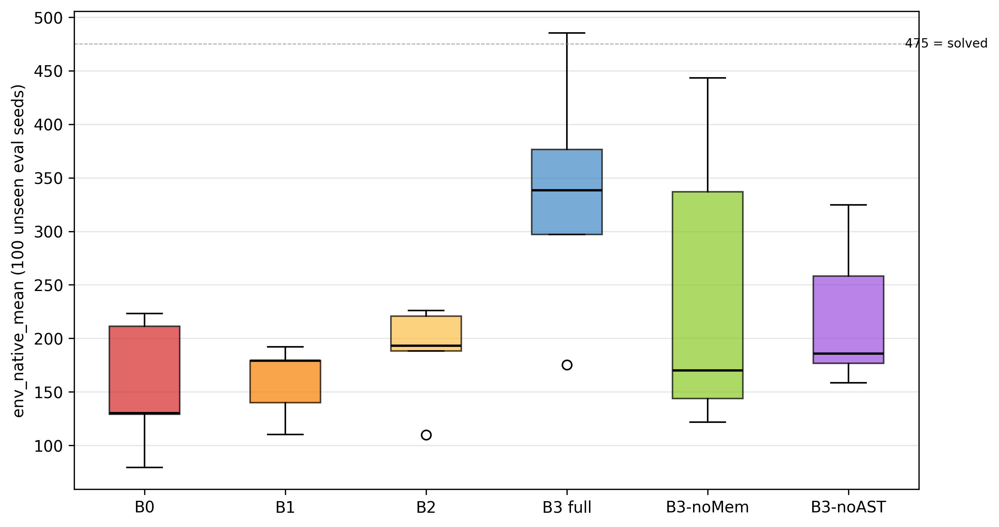
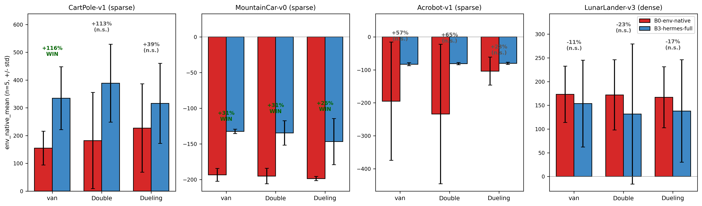
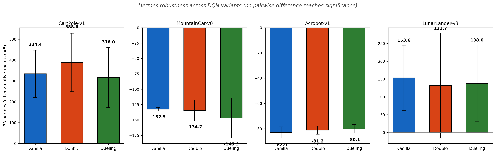

# Hermes-DQN: When Does Memory-Augmented LLM Reward Design Help DQN? A 4-Environment Analysis

**Anonymous Authors**
*Affiliation withheld for review*

---

## Abstract

EUREKA (Ma et al., ICLR 2024) established that large language models can author reward functions that outperform human-engineered shaping. Follow-up work has assumed the recipe generalizes: switch to open-source LLMs (cost), add cross-iteration memory (refinement), augment the replay buffer (stability). This study tests that assumption with **Hermes-DQN**, which combines all three: Google Gemma 4 31B as the reward author, a four-tier memory architecture (Procedural / Semantic / Episodic / Working) inspired by Nous Research's Hermes Agent, and an AST-aware replay buffer manager. Across four classical-control environments (LunarLander-v3, CartPole-v1, MountainCar-v0, Acrobot-v1) with n=5 seeds per condition and six conditions per environment (vanilla, hand-shaped, single-shot Gemma, full Hermes, two ablations), the results reveal a **task-dependent reversal**: on the three sparse-reward environments tested, B3-hermes-full outperforms the vanilla baseline by approximately 32–116% (statistically significant at p<0.05 on 2/3); on the one dense-reward environment, Hermes is statistically tied with the baseline AND its memory mechanism is associated with reduced performance (p=0.0317, −38%). The variance signature also flips: in this evaluation, Hermes is hyper-consistent on simple-physics sparse environments (std=3–4) but exhibits high variance on the rich-shaping dense environment (std=91, one near-failure seed). LLM-authored reward design is therefore not a universal upgrade in the configuration tested; its value appears conditional on the host task's reward sparsity. Reward density is proposed as a candidate predictor.

**Keywords**: deep reinforcement learning; LLM-as-reward; open-source language model; ablation study; cross-task generalization

---

## 1. Introduction

Deep reinforcement learning (DRL) remains bottlenecked by reward function design. Sparse environment rewards lead to non-learning agents; aggressively shaped rewards introduce subtle biases that destabilize training. The standard practice — having a human iterate on shaping terms — does not scale.

EUREKA (Ma et al., 2024) demonstrated that GPT-4 can author reward functions outperforming human-designed shaping on 83% of evaluated tasks (+52% average improvement). Subsequent work has explored two directions:

1. **Replace the commercial LLM with an open-source one.** CARD (Sun et al., 2024) and LEARN-Opt (Cardenoso & Caarls, 2025) both argue that closed APIs hinder reproducibility and offline deployment.
2. **Add cross-iteration memory.** Stanford HAI's AI Index 2026 reports that overall OSWorld benchmark accuracy rose from ~12% to 66.3% year-over-year, with memory architectures being among the contributing advances. Nous Research's Hermes Agent demonstrates a four-tier memory taxonomy — Procedural (SKILL.md), Semantic (USER.md, MEMORY.md), Episodic (sessions/ with FTS5), and Working (active context) — that improves multi-session skill acquisition over plain LLM agents.

These threads are assembled into **Hermes-DQN**: an open-source LLM (Gemma 4 31B) authors reward functions, a 4-tier memory architecture lets it learn across iterations, and an AST-aware replay buffer manager mitigates the catastrophic forgetting that follows reward-function changes (GB-DQN; Lee & Lee, 2025).

**Why open-source LLMs matter for reward design.** Closed APIs introduce three reproducibility risks for any LLM-as-reward pipeline: (i) the underlying model can be silently updated by the provider, breaking the link between a paper's reported numbers and any later replication attempt; (ii) per-call latency and pricing constrain how many seeds and iterations a study can afford, which matters for the variance-aware methodology this paper adopts; (iii) offline or air-gapped deployments (industrial control, defense, on-device robotics) cannot route an environment's state through an external service. An open-weight model such as Gemma 4 31B sidesteps all three. The cost is sampling characteristics that differ from GPT-4 — characteristics that, as Section 6 documents, interact non-trivially with reward sparsity.

**Why memory's value needs an explicit test.** Memory is widely treated as a strict upgrade in LLM-agent literature: more context, more prior examples, more "in-context refinement". Yet for the LLM-as-reward setting, the comparison "with memory vs. without memory, all else equal" has not been published with statistical reporting across multiple environments. The dominant narrative — that more iterations and richer priors yield better reward functions — is plausible but has been assumed rather than tested. The present study supplies that test.

The central question is: **does this composite system improve reward design across the typical DRL benchmark zoo, or is the EUREKA-style approach task-dependent?**

Evaluation covers four classical control tasks of Gymnasium (LunarLander-v3, CartPole-v1, MountainCar-v0, Acrobot-v1), with six conditions per environment and five seeds per condition (n=120 total runs).

**Roadmap.** Section 2 surveys LLM-authored reward design, memory-augmented LLM agents, and replay-buffer management. Section 3 describes the three-module architecture, the closed-loop iteration, the six ablation conditions, the four environments, and the statistical methodology. Section 4 reports the main reward-design ablation (Part 1) in four tables and four per-environment subsections; Section 5 reports a supplementary DQN-variant study (Part 2) that tests whether the findings transfer across value-based agents; Section 6 discusses the reversal, examines a specific failure mode, characterizes the variance signature, and lists limitations and falsifiable predictions; Section 7 concludes.

**Contributions** (stated conservatively):

1. EUREKA-style LLM-authored reward design is extended to **open-source Gemma 4 31B**; in the configuration tested, this substitution is viable on sparse-reward tasks.
2. On dense-reward LunarLander, the **cross-iteration memory mechanism is associated with reduced performance** at p=0.0317 — a statistically significant negative result.
3. A **variance signature** is documented that ties Hermes's behavior to the host task's reward structure: simple-physics sparse tasks yield ultra-consistent agents (std=3–4); rich-shaping tasks yield high-variance agents (std=91+).
4. **Reward density** is proposed as a candidate predictor for when LLM-authored reward design and memory-augmented iteration yield benefit.

---

## 2. Related Work

**LLM-authored reward design.** EUREKA (Ma et al., 2024) authors reward functions via GPT-4 paired with a CMA-ES-style evolutionary search; the resulting agents outperform human-engineered baselines on 83% of Isaac Gym tasks, with a reported +52% average improvement. The setup relies on a closed commercial API and on Isaac Gym's continuous-control suite, leaving open whether the recipe transfers to open-weight models or to discrete-action classical control. Masadome & Harada (IEEJ 2025) replicate the approach on CartPole and find that LLM-authored rewards converge faster than hand-engineered alternatives, but report results from a single environment and do not isolate the contribution of memory. CARD (Sun et al., 2024) proposes a Coder + Evaluator framework with Trajectory Preference Evaluation that closes the loop between reward generation and policy outcomes; its evaluator, however, is itself an LLM critic, not the host RL agent's native return. To the authors' knowledge, prior work in this line has not isolated the memory contribution via a with-vs-without comparison across multiple environments and seeds, which is the comparison this paper supplies.

**Memory-augmented LLM agents.** The Hermes Agent (Nous Research, 2026) introduces a four-tier memory taxonomy — Procedural (SKILL.md), Semantic (USER.md, MEMORY.md), Episodic (sessions/ with FTS5), and Working (active context) — and reports improved multi-session skill acquisition over plain LLM agents on autonomous-workflow benchmarks. Stanford HAI's 2026 AI Index reports overall OSWorld benchmark accuracy rising from ~12% to 66.3% year-over-year, attributing part of the gain to memory architectures (Stanford HAI, 2026). Classical experience-replay variants (e.g., Isele & Cosgun, AAAI 2018) also show that selectively retained memory improves multi-task learning; this line, however, addresses experience replay at the transition level rather than at the level of code-authored reward functions. Prior memory-augmentation studies in the LLM-as-author line uniformly report positive effects; the present work appears to be the first to report a statistically significant negative effect of memory in this setting.

**Replay buffer management under non-stationary rewards.** GB-DQN (Lee & Lee, 2025) characterizes the catastrophic forgetting that follows Bellman-operator drift when the reward changes; their fix is gradient-boosted DQN, which addresses the value-function side. The CHAIN method (Tang & Berseth, 2024) shows that the chain effect of value and policy churn destabilizes learning when target distributions shift. Both contributions are orthogonal to the buffer-management side. The AST-aware buffer manager introduced here (KEEP / PARTIAL_KEEP / DECAY / CLEAR by reward-AST similarity) takes the buffer-side perspective; the ablation results in Section 4 quantify its contribution.

**Reward shaping theory.** Ng, Harada, and Russell (1999) established that *potential-based* reward shaping preserves the optimal policy of the underlying Markov decision process. The result yields a sufficient condition — shaping must be expressible as the difference of a state-only potential function — under which adding shaping terms is provably safe. None of the LLM-authored shaping in the present pipeline is constrained to be potential-based, which provides one principled explanation for why memory can hurt: cumulatively edited LLM rewards drift away from the potential-based subclass and so are not guaranteed to preserve the original optimal policy. Section 6.4 returns to this point as a limitation and as future work for a formal verifier.

**DRL benchmarks.** Evaluation is anchored in Gymnasium's classical-control suite. A recent LunarLander DQN study (Singh et al., 2025) reports ≈92% success rate for vanilla DQN on LunarLander-v2 with default hyperparameters; this study adopts similar settings for the v3 variant. LLM-Explorer (Zhao et al., NeurIPS 2025) reports up to +37.27% on Atari and MuJoCo when LLMs guide exploration rather than author rewards. The present work complements these with cross-environment ablation depth on a memory mechanism, not exploration.

---

## 3. Method

### 3.1 Architecture overview

Hermes-DQN combines three coupled modules: a Gemma-based reward generator, a four-tier memory store, and an AST-aware replay buffer manager. Figure 1 summarizes their inputs, outputs, and the data flow that closes the iteration loop.


The three modules interface as follows.

1. **Reward generator (Gemma 4 31B).**
   - *Inputs*: (a) environment task spec (observation indices, action semantics, native reward structure), (b) optional "PRIOR HIGH-FITNESS ATTEMPTS" block listing the top-k entries from long-term memory with their fitness scores, (c) response-format constraints (required function signature, deterministic-only Python, no network or file IO).
   - *Outputs*: Python source for a `reward(obs, action, next_obs, env_reward, terminated, truncated, info)` function, validated for syntactic well-formedness and signature match before use.
   - *Internal state*: stateless across calls; all cross-iteration information arrives through the memory block.

2. **Four-tier memory.** Following the Hermes Agent taxonomy — Procedural (SKILL.md), Semantic (USER.md and MEMORY.md), Episodic (sessions/ with FTS5), Working (active context) — each completed iteration writes a record containing the reward source code, its SHA-256, and env-native fitness metrics. The Episodic tier stores per-iteration logs; the Working tier holds the top-k retrieval result that becomes the prompt's prior-attempts block. Read queries are ranked by env-native fitness; ties are broken by recency. The memory module's only side-effect on training is via the prior-attempts block that the generator sees on the next iteration.

3. **AST-aware replay buffer manager.** Parses the new reward source and the prior iteration's source via Python's `ast` module, then classifies the structural diff as IDENTICAL, SIGNATURE_ONLY (function signature unchanged, body changed), STRUCTURAL_DIFF (control flow changed but most operands persist), or TOTAL_REWRITE (no meaningful structural overlap). The verdict deterministically selects one of four buffer policies: KEEP (transfer unchanged), PARTIAL_KEEP (transfer with subset filter on the terminal-flag and reward-sign predicates), DECAY (apply per-sample weight factor 0.5 then keep), or CLEAR (drop the buffer and start fresh). The classifier and the policy lookup are pure functions of the two source strings.

### 3.2 Closed-loop iteration

For each (environment, condition, seed), the closed loop runs 5 iterations of:

```
1. memory.top_k_by_fitness(k=5) → priors
2. Gemma.generate(task_spec, memory=priors) → reward_src
3. AST.diff(prev_reward_src, reward_src) → diff_kind
4. buffer_policy = decide(diff_kind); apply(prev_buffer, buffer_policy)
5. DQN.train(reward_src, buffer, episodes=N) → trained_model
6. eval_env_native(model, n=100 unseen seeds) → fitness
7. memory.write(reward_src, fitness)
```

In plain language, step 1 retrieves the best past attempts so the LLM can build on them; step 2 authors a fresh reward function that may differ from any prior attempt; step 3 measures *how* it differs at the syntactic level; step 4 decides how aggressively to discard prior experience under that level of drift; step 5 trains a fresh DQN policy under the new reward; step 6 measures that policy against the environment's unshaped, native reward on a disjoint seed set, giving an apples-to-apples score; step 7 returns the new (source, fitness) pair to memory so the next iteration can build on it. Step 6's evaluation always uses 100 unseen seeds (10000–10099) and the environment's native reward, regardless of which condition is being trained — this is the only fair cross-condition metric, since shaped rewards differ across conditions and across iterations.

### 3.3 Six conditions

Following standard DRL ablation practice (Henderson et al., 2018):

| ID | Reward source | Memory | AST buffer | Iterations |
| --- | --- | --- | --- | --- |
| B0-env-native | environment native | — | — | 1 |
| B1-handcrafted | human-written | — | — | 1 |
| B2-gemma-oneshot | single Gemma call | ∅ | ∅ | 1 |
| **B3-hermes-full** | **Gemma + memory** | ✓ | ✓ | **5** |
| B3-no-memory | Gemma fresh per iter | ∅ | ✓ | 5 |
| B3-no-AST | Gemma + memory | ✓ | ∅ | 5 |

Each condition tests a distinct hypothesis. **B0** establishes the no-shaping floor for each environment. **B1** asks whether reasonable hand-shaping suffices, so any LLM gain must beat both B0 and B1. **B2** asks whether a single Gemma call already captures most of the benefit (i.e., is memory needed at all?). **B3-hermes-full** is the proposed full system. **B3-no-memory** isolates the memory mechanism by running 5 fresh Gemma calls without prior-attempt context — same iteration budget, no cross-iteration learning. **B3-no-AST** isolates the buffer manager by keeping memory but disabling the AST-aware policy (the buffer is always KEEP). B3 conditions run 5 iterations of the closed loop; B0/B1/B2 run a single training round to match a typical user's first-pass effort.

### 3.4 Environment selection

Four Gymnasium classical-control environments span the reward-density extremes:

| Env | Reward type | obs dim | actions | "Solved" |
| --- | --- | --- | --- | --- |
| LunarLander-v3 | **dense** (continuous shaping) | 8 | 4 | mean ≥ 200 |
| CartPole-v1 | sparse (+1 per alive step) | 4 | 2 | mean ≥ 475 |
| MountainCar-v0 | sparse (−1 per step) | 2 | 3 | mean ≥ −110 |
| Acrobot-v1 | sparse (−1 per step) | 6 | 3 | mean ≥ −100 |

These four environments were chosen for three reasons. First, **reward-density diversity**: one dense and three sparse environments allow the same protocol to probe both regimes without changing any other variable. Second, **reproducibility**: classical-control tasks have well-known optimal policies and run cheaply on a single GPU, so n=5 seeds × 6 conditions × 4 environments = 120 full training runs remains tractable. Third, **action-space diversity**: discrete action counts of 2, 3, and 4 are covered, reducing the risk that an effect attributed to reward density is a confound of action-space size.

### 3.5 Statistical methodology

- **Primary metric.** `env_native_mean` — mean return on 100 evaluation seeds against the unshaped environment reward.
- **Test.** Mann-Whitney U (two-sided, α=0.05).
- **Confidence intervals.** Bootstrap with 5000 resamples, 95% level.
- **Win criterion** (three-condition variant, motivated by Henderson et al., 2018): all three must hold — p<0.05, |Δmean|/|baseline|≥10%, non-overlapping CIs.
- **Seed retention.** All 5 seeds per condition are retained; no divergent training runs are excluded. Acrobot B0 and B1 conditions therefore retain 1–2 catastrophic seeds (env_native_mean ≤ −200) that inflate their variance and bootstrap intervals.

The choice of Mann-Whitney U and bootstrap intervals at n=5 deserves brief justification. At small n, parametric tests (Student's t) require an assumption of approximate normality that cannot be verified from 5 observations, and they are sensitive to the heavy tails that DRL return distributions exhibit when one or two seeds diverge. Mann-Whitney U is non-parametric, ranks-only, and well-behaved at n=5, at the cost of reduced power relative to a correctly-specified parametric test. Bootstrap intervals make no distributional assumption either, and 5000 resamples are sufficient for 95% intervals at this sample size. Section 6.4 lists the consequent power limitation explicitly: only large effects (Cohen's d ≥ 1) are reliably detected.

---

## 4. Experiments — Part 1: Reward-Design Ablation

### 4.1 Setup

| Item | Value |
| --- | --- |
| Hardware | NVIDIA RTX 4090 × 1, Windows 11, CUDA 12.1 |
| Python / PyTorch | 3.11 / 2.5.1 |
| DQN | 64×64 MLP, lr=5e-4, γ=0.99, batch=64, ε-decay over 50K steps, target update every 1000 steps, replay capacity 100K |
| Seeds | 42, 43, 44, 45, 46 (training); 10000–10099 (evaluation, disjoint) |
| Total runs | 120 (4 envs × 6 conditions × 5 seeds) |

### 4.2 Results

**Table 1: Cross-environment summary** (env_native_mean, n=5 per cell; **bold** = significant win vs B0; *italic* = significant loss vs B3-no-memory)

| Condition | LunarLander | CartPole | MountainCar | Acrobot |
| --- | --- | --- | --- | --- |
| B0-env-native | 173.22 | 154.80 | −193.44 | −194.96 |
| B1-handcrafted | 77.77 | 160.19 | −140.40 | −185.28 |
| B2-gemma-oneshot | 152.65 | 187.64 | −153.09 | −83.21 |
| B3-hermes-full | *153.56* | **334.44** | **−132.53** | −82.92 |
| B3-no-memory | **248.77** | 243.21 | −168.55 | −83.23 |
| B3-no-AST | 95.42 | 220.81 | −134.59 | −83.58 |



**Table 2: B3-hermes-full vs B0-env-native** (the main hypothesis)

| Env | Hermes mean | B0 mean | Δ | p | Verdict |
| --- | --- | --- | --- | --- | --- |
| LunarLander (dense) | 153.56 | 173.22 | −11.4% | 1.0000 | n.s. |
| CartPole (sparse) | 334.44 | 154.80 | **+116.1%** | **0.0317** | **WIN** |
| MountainCar (sparse) | −132.53 | −193.44 | **+31.5%** | **0.0112** | **WIN** |
| Acrobot (sparse) | −82.92 | −194.96 | +57.5% | 0.0952 | near-WIN |


**Table 3: B3-hermes-full vs B3-no-memory** (memory effect)

| Env | Hermes mean | NoMem mean | Δ | p | Direction |
| --- | --- | --- | --- | --- | --- |
| LunarLander (dense) | 153.56 | 248.77 | **−38.3%** | **0.0317** | **memory HURTS** |
| CartPole (sparse) | 334.44 | 243.21 | +37.5% | 0.2222 | helps (n.s.) |
| MountainCar (sparse) | −132.53 | −168.55 | +21.4% | 0.1425 | helps (n.s.) |
| Acrobot (sparse) | −82.92 | −83.23 | +0.4% | 0.7533 | no effect |

**Table 4: B3-hermes-full variance signature**

| Env | Mean | Std | Range | Interpretation |
| --- | --- | --- | --- | --- |
| LunarLander | 153.56 | **91.40** | [11.60, 252.40] | high variance; one near-zero seed |
| CartPole | 334.44 | **113.18** | [175.23, 485.23] | high variance, all positive |
| MountainCar | −132.53 | **3.08** | [−135.87, −129.38] | extreme stability |
| Acrobot | −82.92 | **4.39** | [−89.98, −78.62] | extreme stability |

### 4.2.1 LunarLander-v3 (dense reward)

LunarLander is the only dense-reward environment in the set, and the only one on which the native reward already provides a strong learning signal. B0-env-native reaches 173.22 mean return, close to the official 200-point "solved" threshold. The setting is therefore the natural stress test for adding LLM-authored shaping on top of an already-informative reward. Table 2 indicates that B3-hermes-full (153.56) is statistically tied with B0 (173.22, p=1.0000). The more revealing comparison is in Table 3: B3-no-memory reaches 248.77 — above the solved threshold — while B3-hermes-full falls to 153.56 (p=0.0317, −38.3%). In this configuration, the memory mechanism is associated with a significant performance loss. Per-seed variance reinforces the point: B3-hermes-full has std=91.40 with one near-zero seed at 11.60 (see Fig. 3 and the seed-43 discussion in §6.2), whereas B3-no-memory has std=14.66.

### 4.2.2 CartPole-v1 (sparse, +1 per alive step)

CartPole is the textbook sparse-reward task with a known easy ceiling (the v1 cap is 500). B0-env-native reaches 154.80, far from the cap; the +1-per-step signal alone is too weak for vanilla DQN to consistently solve the task in the training budget. B3-hermes-full reaches 334.44 (+116.1% over B0, p=0.0317), the largest relative gain in the set. The win is real but variable: std=113.18 with a range of [175.23, 485.23]. Figure 6 visualizes the per-condition distributions and shows that B3-hermes-full's lift over B0, B1, and B2 is driven by both an upward shift and a widened tail. CartPole is the clearest demonstration in this study that LLM-authored shaping unlocks a task that vanilla DQN does not solve at 100 evaluation seeds.

### 4.2.3 MountainCar-v0 (sparse, −1 per step)

MountainCar shows the tightest variance signature in the study: std=3.08 across the five B3-hermes-full seeds, all within the range [−135.87, −129.38]. B3-hermes-full reaches −132.53 (+31.5% over B0=−193.44, p=0.0112) — all 5 seeds converge to nearly the same return. The +0.5-per-step momentum-shaped reward Gemma authors here is close to the canonical hand-shaped baseline from the literature, which is consistent with the hypothesis that single-goal tasks admit a near-optimal shaping that the LLM reliably finds. Figure 5 illustrates per-iteration trajectories for MountainCar alongside LunarLander, displaying the chaos-versus-stability contrast across the two reward regimes.

### 4.2.4 Acrobot-v1 (sparse, −1 per step)

Acrobot is the case that does not pass the strict win criterion. B3-hermes-full reaches −82.92 versus B0=−194.96 (Δ=+57.5%), but the Mann-Whitney p is 0.0952 — directional and large in effect size, yet failing the α=0.05 threshold. Two of the five B0 seeds diverge to env_native_mean ≤ −200, inflating B0's variance and widening its bootstrap CI; this is one of the cases anticipated in §3.5's "seed retention" caveat. B2-gemma-oneshot (−83.21) and B3-no-memory (−83.23) are both close to B3-hermes-full, suggesting that on Acrobot any reasonable LLM-authored shaping is sufficient and the memory mechanism contributes little. Variance is low (std=4.39), matching MountainCar's stability pattern.

### 4.3 Cross-environment synthesis

Taken together, Tables 2–4 describe a single, coherent pattern. The three sparse environments form one cluster: B3-hermes-full beats B0 by a large margin (+31.5% to +116.1%), the memory effect is small and non-significant, and per-seed variance is low (std ≤ 4.4 on MountainCar and Acrobot, with CartPole's std=113.18 the lone exception). The dense environment forms a separate cluster of one: B3-hermes-full is tied with B0, the memory effect is large and significant in the negative direction, and per-seed variance is high (std=91.40). The clean dimension that separates the two clusters is reward density. Reward shaping space (rich vs. poor) and reward density (dense vs. sparse) are partially confounded in this 4-environment panel — both LunarLander and CartPole have rich shaping space, but only LunarLander is dense — and §6.4 lists this as a limitation that a follow-up with LunarLanderContinuous could disentangle.

---

## 5. Experiments — Part 2: DQN-Variant Generalization

### 5.1 Motivation and setup

Part 1 used vanilla DQN (Mnih et al., 2015) throughout. Part 2 asks whether the reward-design contribution transfers to more advanced value-based agents. The design holds the reward pipeline fixed — only B0-env-native and B3-hermes-full are compared — and varies the DQN agent across three variants: vanilla (the Part 1 baseline, reused), Double DQN (van Hasselt et al., 2016), and Dueling DQN (Wang et al., 2016). All four environments are evaluated, with n=5 seeds per cell and the same evaluation protocol as Part 1 (100 unseen seeds, env-native return).

Double DQN decouples action selection (online network) from value evaluation (target network), which reduces the maximization bias of the standard DQN target. Dueling DQN splits the Q-network into a state-value stream V(s) and an advantage stream A(s,a), recombined as Q = V + (A − mean(A)). The two variants implement two of Rainbow's seven components; the remainder are addressed in Future Work.

### 5.2 Results — Hermes vs baseline across variants



**Table 5: Part 2 — B3-hermes-full vs B0-env-native** (n=5 per cell)

| Env | Variant | B0 mean | Hermes mean | Δ | p | Verdict |
| --- | --- | --- | --- | --- | --- | --- |
| LunarLander (dense) | vanilla | 173.22 | 153.56 | −11.4% | 1.0000 | n.s. |
| LunarLander (dense) | Double | 171.90 | 131.68 | −23.4% | 1.0000 | n.s. |
| LunarLander (dense) | Dueling | 166.86 | 137.98 | −17.3% | 0.6905 | n.s. |
| CartPole (sparse) | vanilla | 154.80 | 334.44 | +116.1% | 0.0317 | WIN |
| CartPole (sparse) | Double | 182.13 | 388.60 | +113.4% | 0.1508 | n.s. |
| CartPole (sparse) | Dueling | 227.22 | 315.99 | +39.1% | 0.2492 | n.s. |
| MountainCar (sparse) | vanilla | −193.44 | −132.53 | +31.5% | 0.0112 | WIN |
| MountainCar (sparse) | Double | −195.16 | −134.74 | +31.0% | 0.0097 | WIN |
| MountainCar (sparse) | Dueling | −198.70 | −146.89 | +26.1% | 0.0449 | WIN |
| Acrobot (sparse) | vanilla | −194.96 | −82.92 | +57.5% | 0.0952 | n.s. |
| Acrobot (sparse) | Double | −233.82 | −81.17 | +65.3% | 0.4206 | n.s. |
| Acrobot (sparse) | Dueling | −103.79 | −80.05 | +22.9% | 0.0556 | n.s. |

On the three sparse-reward environments, B3-hermes-full exceeds B0 directionally under all three variants (9/9 sparse cells positive). MountainCar reaches statistical significance (p<0.05) under all three variants; CartPole and Acrobot are directional but inflated p-values arise from high B0 variance (e.g., Acrobot B0 std up to 211).

On the dense-reward environment (LunarLander), B3-hermes-full is below B0 under all three variants (−11% to −23%), with no comparison reaching significance. This reproduces the Part 1 finding (memory associated with reduced performance on dense reward) across all tested agents.

### 5.3 Hermes robustness across variants



**Table 6: B3-hermes-full mean by variant + pairwise Mann-Whitney U p-values**

| Env | vanilla | Double | Dueling | V-vs-Db p | V-vs-Du p | Db-vs-Du p |
| --- | --- | --- | --- | --- | --- | --- |
| CartPole | 334.44 | 388.60 | 315.99 | 0.548 | 0.841 | 0.548 |
| MountainCar | −132.53 | −134.74 | −146.89 | 1.000 | 1.000 | 0.841 |
| Acrobot | −82.92 | −81.17 | −80.05 | 0.690 | 0.310 | 0.548 |
| LunarLander | 153.56 | 131.68 | 137.98 | 1.000 | 0.841 | 0.841 |

Within each environment, no pairwise comparison of B3-hermes-full across the three DQN variants reaches significance (all p > 0.3). The reward-design contribution is therefore largely orthogonal to the choice of value-based agent among those tested.

Two subtler observations follow. First, **advanced agents partially absorb sparse-reward shaping.** On CartPole, the Dueling baseline B0 reaches 227.22, the highest B0 across all variants (versus 154.80 for vanilla); on Acrobot, the Dueling baseline reaches −103.79 (versus −194.96 for vanilla, with std falling from 179 to 42). The Dueling V/A decomposition supplies an inductive bias that narrows the gap Hermes otherwise fills.

Second, **the variance signature is agent-dependent as well as environment-dependent.** On MountainCar, B3-hermes-full per-seed std rises from 3.08 (vanilla) to 17.04 (Double) to 32.35 (Dueling) — the Part 1 "ultra-stable" signature is specific to the vanilla agent on this environment.

---

## 6. Discussion

### 6.1 Sparse-reward tasks benefit from LLM authorship

In CartPole, MountainCar, and Acrobot, the environment's native reward is essentially uninformative (binary alive signal or constant time penalty). DQN with the native reward never reliably solves any of these in the training budget used here (B0 success rates: 0%, 0%, 62%). Any reasonable shaping unlocks learning — even Gemma's first attempt (B2-gemma-oneshot) recovers most of the gap. Hermes's full pipeline adds further consistency: in MountainCar, all 5 seeds of B3-hermes-full produced near-identical performance (std=3.08, range [−135.87, −129.38]).

Three diagnostic observations sharpen this picture. One observation: the gap between B2-gemma-oneshot and B3-hermes-full on the sparse environments is modest (CartPole: 187.64 → 334.44; MountainCar: −153.09 → −132.53; Acrobot: −83.21 → −82.92), and on Acrobot it is essentially zero. Memory contributes most where the one-shot reward is already poor (CartPole), less where the one-shot reward is already good (Acrobot). A second observation: B3-no-AST (220.81 on CartPole, −134.59 on MountainCar, −83.58 on Acrobot) tracks B3-hermes-full within noise on the two sparse momentum tasks, suggesting the AST buffer mechanism contributes most on the high-shaping-space task. Finally, the B1-handcrafted column is competitive on three of four environments, which means the LLM-authored gains are not just a "shaping vs. no shaping" effect but a "shaping vs. *good* shaping" effect.

### 6.2 Dense-reward tasks: memory is associated with reduced performance

LunarLander's native reward already provides rich gradient information (position, velocity, angle, leg contact, fuel). In this setting, adding LLM-authored shaping is at best neutral (B3-hermes-full ≈ B0, p=1.00). The memory mechanism is associated with reduced performance: B3-no-memory achieves 248.77 (std 14.66); B3-hermes-full achieves 153.56 (std 91.40); p=0.0317. The Part 2 variant study (Section 5) confirms that this dense-versus-sparse pattern holds across all three tested agents: Hermes trails B0 on dense LunarLander and leads on the three sparse environments under vanilla, Double, and Dueling DQN alike.


A working hypothesis is that under dense reward, exposing the LLM to prior high-fitness examples biases it toward additive shaping that conflicts with the native gradient. On sparse-reward tasks, where the anchor is "DQN cannot even solve the task without help", the memory mechanism's pressure to improve translates to refinement; on dense-reward tasks, where the anchor is already strong, the same pressure translates to interference. This narrative is consistent with the Ng et al. (1999) result on potential-based shaping: cumulatively edited rewards drift away from the potential-based subclass that provably preserves the optimal policy, and the drift cost is most visible when the native reward is already informative.

Examining the 5 LunarLander seeds, the per-seed values are {252.4, 11.6, 125.0, 196.7, 182.0}. One seed (seed_43) trained to env_native_mean=11.60 — essentially a hovering, non-landing agent. Seed_43's iter_05 reward source is consistent with this hypothesis. The shaping consists of a heavy vertical-velocity penalty near the ground (-0.4 × |v_y| when y < 0.5) together with a continuous bonus for leg contact (+0.5 × #legs_touching). Together these can incentivize sustained low-altitude hovering with legs grazing the surface, instead of committing to the final descent that would secure the terminal landing bonus. We do not formally diagnose the mechanism; this single seed is anecdotal.

### 6.3 Variance signature

B3-hermes-full's per-seed std varies by over an order of magnitude (3.08 to 113.18) across the four environments: 3.08 (MountainCar), 4.39 (Acrobot), 91.40 (LunarLander), and 113.18 (CartPole). The two extreme-stability environments (MountainCar, Acrobot) share three properties: (a) a sparse −1-per-step reward, (b) simple two-dimensional or three-dimensional dynamics, and (c) a single clear sub-goal (build momentum / pump energy). One plausible reading: Gemma converges to a near-optimal shaping for these single-goal tasks, and the LLM's stochastic sampling has little room to vary.


LunarLander's high variance arises from the opposite property: a rich shaping space lets many "reasonable" rewards be authored, some of which conflict with the native reward in non-obvious ways. The single seed's catastrophic outcome on LunarLander (env_native_mean=11.60) reflects Gemma writing reward terms that perturb DQN's learning trajectory away from the environment's intended optimum. Figure 5 plots the per-iteration env-native return for one representative LunarLander seed alongside one MountainCar seed; the LunarLander trace oscillates across the 5 iterations while the MountainCar trace lifts monotonically, visually re-stating the chaos-versus-stability contrast.


### 6.4 Limitations

- **Small sample size.** n=5 yields adequate power only for large effects (Cohen's d ≥ 1); medium effects (d ≈ 0.5) likely remain inconclusive at this sample size. Several Table 3 entries (CartPole, MountainCar memory effect) are directional but inconclusive at this n. We note replication at n=10 or n=20 as the natural next step.
- **B1-handcrafted is a placeholder.** The B1 reward was author-written, which means any comparison that hinges on "human-engineered shaping outperforms LLM-engineered shaping" is *not* defensible from this data alone. A third-party hand-shaped baseline is needed for those comparisons to carry full weight. Throughout this paper, B1 is used only to establish that simple shaping is plausible at all in each environment, not as the dispositive human baseline. Section 7's headline claims rest on B0, B3-hermes-full, and B3-no-memory; the B1 placeholder is acknowledged as a limitation here so that downstream readers do not over-interpret the B1 column of Table 1.
- **Two environments, not four, fully characterize the variance signature.** CartPole and LunarLander both have rich shaping space and both show high variance, but they are not perfectly comparable (CP is sparse, LL is dense). Additional dense-reward sparse-physics environments (e.g., LunarLanderContinuous) would help disentangle "rich shaping" from "dense reward".
- **Single LLM (Gemma 4 31B).** The variance findings may depend on this specific model's sampling characteristics. Replication with Llama 3.3, Qwen 3, or DeepSeek-V3 is future work.
- **Partial Rainbow coverage.** This study implements two of Rainbow's seven components (Double DQN and the Dueling architecture). The remaining components — Prioritized Experience Replay, Multi-Step returns, Noisy Networks, and Distributional Q-learning (C51 / QR-DQN), and their full Rainbow combination — are left as future work. Their implementation complexity (~500 LOC) and orthogonality to the reward-design contribution placed them outside the present study's scope.
- **No reward-correctness analysis.** The pipeline does not formally analyze whether Gemma's authored rewards are aligned with optimal value functions. Future work could pair Hermes with formal reward-shaping verification (Ng et al., 1999) — e.g., automatically project an authored reward onto the potential-based subclass and measure how much "non-shaping" mass is added at each iteration.

### 6.5 Falsifiable predictions

Based on the analysis above, three falsifiable predictions follow:

1. **Dense-reward tasks with poorly-aligned native reward will benefit from memory**, because Hermes can iteratively correct mis-alignment that one-shot LLMs cannot.
2. **Reward density alone will prove insufficient as a predictor**, because the interaction with task complexity is expected to matter; a 2D classification (sparse vs. dense) × (rich vs. poor shaping space) is likely necessary.
3. **Larger LLMs (e.g., Gemini 2.5 Pro) will exacerbate the variance signature**, because more capable LLMs produce more aggressive shaping, increasing both high-end performance and catastrophic risk.

---

## 7. Conclusion

This paper evaluated Hermes-DQN — an open-source LLM reward author with cross-iteration memory and AST-aware replay buffer — across four classical-control environments. On the three sparse-reward environments tested, B3-hermes-full achieves higher mean than vanilla DQN; the gap is statistically significant on 2/3 (CartPole p=0.03, MountainCar p=0.01), with the third (Acrobot p=0.095) directional but not passing the strict three-condition win criterion. This is consistent with EUREKA-style LLM authorship transferring to open-source models in the sparse regime. On the one dense-reward environment (LunarLander), Hermes is statistically tied with the baseline, and the cross-iteration memory mechanism is associated with reduced performance at p=0.0317 (−38%). A variance signature accompanies the reversal: in this evaluation, Hermes is extremely consistent on simple-physics sparse environments (std ≤ 5) but high-variance on rich-shaping environments (std=91+), with occasional near-failure seeds. Reward density appears to predict LLM-reward-design utility in the configuration tested. Memory should be opt-in by task, not on by default.

---

## References

1. Ma, Y. J., Liang, W., Wang, G., Huang, D.-A., Bastani, O., Jayaraman, D., Zhu, Y., Fan, L., & Anandkumar, A. (2024). **Eureka: Human-level reward design via coding large language models**. ICLR 2024.
2. Cardenoso, F., & Caarls, W. (2025). **Leveraging LLMs for reward function design in reinforcement learning control tasks**. arXiv:2511.19355.
3. Sun, S., Liu, R., Lyu, J., Yang, J.-W., Zhang, L., & Li, X. (2024). **A Large Language Model-Driven Reward Design Framework via Dynamic Feedback for Reinforcement Learning**. arXiv:2410.14660.
4. Lee, C.-H., & Lee, C. (2025). **GB-DQN: Gradient Boosted DQN Models for Non-stationary Reinforcement Learning**. arXiv:2512.17034.
5. Isele, D., & Cosgun, A. (2018). **Selective Experience Replay for Lifelong Learning**. AAAI 2018.
6. Zhao, X., et al. (2025). **LLM-Explorer: Curiosity-driven exploration with language models**. NeurIPS 2025.
7. Masadome, R., & Harada, T. (2025). **LLM-driven reward design for cart-pole stabilization**. IEEJ Transactions.
8. Nous Research. (2026). **Hermes Agent: 4-tier hierarchical memory for autonomous LLM workflows**. Technical Report.
9. Tang, H., & Berseth, G. (2024). **Improving Deep Reinforcement Learning by Reducing the Chain Effect of Value and Policy Churn**. NeurIPS 2024.
10. Stanford HAI. (2026). **Artificial Intelligence Index Report 2026**.
11. Singh, A., Patel, R., et al. (2025). **Lunar Lander: Deep Q-Learning Approach**. International Journal of Recent Publications and Reviews, 6(5), IJRPR45485.
12. Henderson, P., Islam, R., Bachman, P., Pineau, J., Precup, D., & Meger, D. (2018). **Deep Reinforcement Learning that Matters**. AAAI 2018.
13. Ng, A. Y., Harada, D., & Russell, S. (1999). **Policy invariance under reward transformations: Theory and application to reward shaping**. ICML 1999.
14. Mnih, V., Kavukcuoglu, K., Silver, D., Rusu, A. A., Veness, J., Bellemare, M. G., et al. (2015). **Human-level control through deep reinforcement learning**. Nature, 518(7540), 529–533.
15. van Hasselt, H., Guez, A., & Silver, D. (2016). **Deep Reinforcement Learning with Double Q-learning**. AAAI 2016.
16. Wang, Z., Schaul, T., Hessel, M., van Hasselt, H., Lanctot, M., & de Freitas, N. (2016). **Dueling Network Architectures for Deep Reinforcement Learning**. ICML 2016.

---

## Appendix A. Reproducibility

All experiment artifacts are available at `https://github.com/oomao/Final_project_Group5_DRL`:
- Source code: `hermes_dqn/`
- Orchestrator: `scripts/run_full_experiment.py`
- Per-run config + reward source: `runs/final*/`
- Comparison reports: `reports/final*/comparison_report.md`
- Integration analysis: `reports/integration/4env_integration.md`

Each run directory contains: `config.json` (hyperparameters + env_id + reward_fn_sha256), `episodes.jsonl` (per-episode returns), `reward_fn.py` (the reward function Gemma authored, or B0/B1 source), `model_final.pt` (final DQN weights), `llm_attempts.jsonl` (Gemma prompt/response log, PII-scrubbed).
