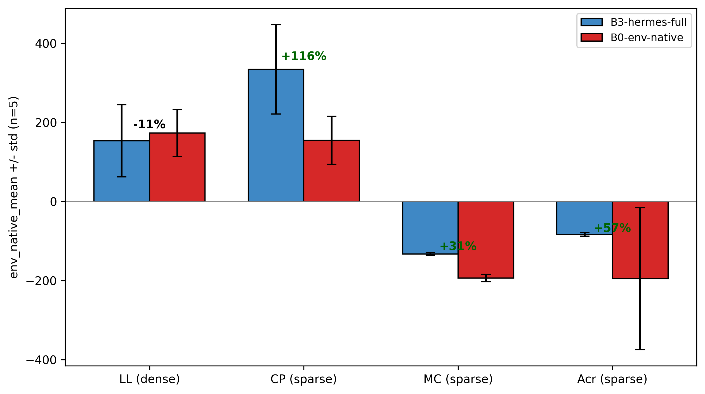
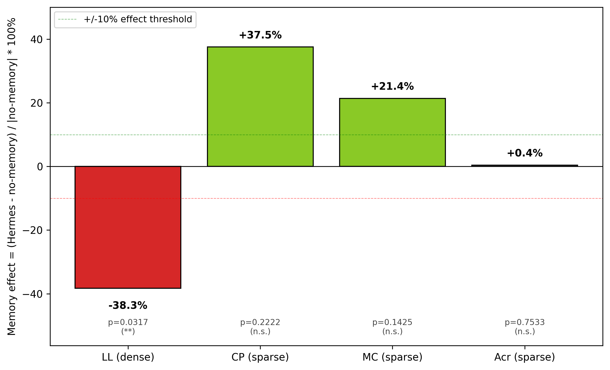
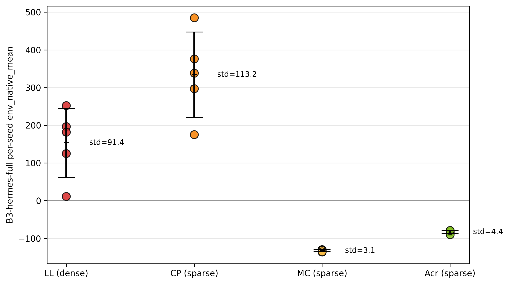
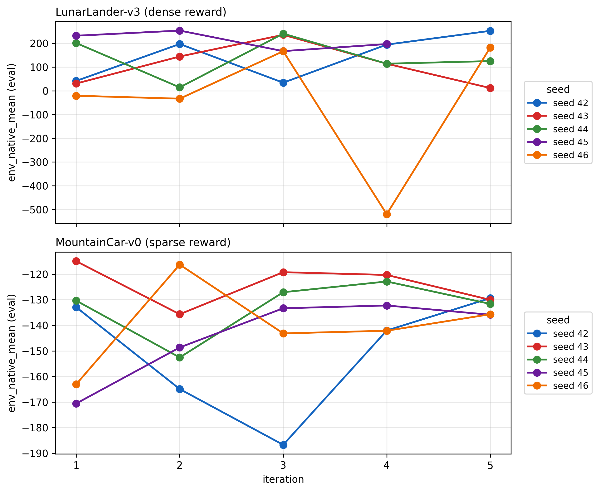

# Hermes-DQN:記憶擴增之大型語言模型獎勵設計何時對 DQN 有效?四環境分析

**陳盛茂 · 林仙安 · 辛語柔 · 陳冠宇**

*國立中興大學 資訊管理學研究所*

---

## Abstract

強化學習要訓練出夠好的智能體,關鍵就落在「獎勵函數」(reward function) 上,它說穿了就是一套規則,負責告訴智能體怎麼做才算做得好,偏偏這套規則一直都不太好設計。EUREKA [1] 在這裡換了個思路,與其讓人一遍又一遍手動去調,不如把獎勵函數直接交給大型語言模型 (Large Language Model, LLM) 寫出來,結果在 83% 的任務上都勝過了人工調出來的版本。順著這個發現,後續研究又分出了三條路,一是改用開源的 LLM,既能省下成本、也能離線部署,二是替模型加上「跨迭代記憶」(cross-iteration memory),好讓它把過去試過的經驗留住、一點一點地學,三是把訓練用的「重播緩衝區」(replay buffer) 加固,讓訓練更穩得住。本研究做的,就是把這三條路一次整進「Hermes-DQN」裡,獎勵交給開源的 Google Gemma 4 31B 來寫,記憶用的是受 Nous Research Hermes Agent 啟發的四層架構 (Procedural / Semantic / Episodic / Working),再搭上一個讀得懂程式碼結構(抽象語法樹,Abstract Syntax Tree, AST)的重播緩衝管理器。實驗放在 Gymnasium 的四個古典控制環境 (LunarLander-v3、CartPole-v1、MountainCar-v0、Acrobot-v1) 上,設了六種條件、每種各跑五個隨機種子,一條一條比下來,會看到一個「看任務而定」的反轉 (task-dependent reversal),在三個「稀疏獎勵」(sparse reward,環境很少給回饋、不太好學)的環境裡,完整版的 Hermes 把沒經加工的基準 (B0) 拉高了大約 31–116%,其中三分之二還達到統計顯著 (p<0.05),可是一換到唯一那個「密集獎勵」(dense reward,環境本來就一路給著回饋)的環境,Hermes 就跟基準幾乎打平,記憶機制甚至還把表現給拖了下來 (p=0.0317、−38%)。另外還冒出一組「穩定度指紋」,有意思的是,真正把它分出高下的並不是獎勵的疏密,而是「可塑形空間」的大小,兩個物理結構單純的環境,Hermes 穩得出奇 (std=3–4),兩個可塑形空間大的環境卻晃得很厲害 (CartPole std=113;LunarLander std=91,還出現一個近乎全崩的種子)。說到底,讓 LLM 來設計獎勵並不是萬靈丹,它到底管不管用,得看任務本身回饋給得疏還是密,本研究也據此建議,把「獎勵密度」(reward density) 拿來當作判斷它何時派得上用場的指標。

*關鍵字*:深度強化學習;LLM 作為獎勵作者;開源大型語言模型;消融研究;跨任務泛化

---

## 1. Introduction

深度強化學習 (Deep Reinforcement Learning, DRL) 長年都卡在同一個瓶頸上,就是獎勵函數很難設計得好。說穿了,獎勵函數就是一套規則,負責告訴智能體 (agent) 哪些行為該被鼓勵,可麻煩的地方在於,環境給的獎勵要是太稀疏、難得才回饋一次,智能體常常就學不起來,反過來,要是人為塞進太多「塑形」獎勵去牽著它走,又容易埋下一些不太看得出來的偏誤,一不小心就把整個訓練給帶偏了。傳統的做法,是讓人一項一項手動去微調這些塑形項,既花時間,也很難放大到更多場景上。

EUREKA [1] 在這裡轉了個彎,既然人工調得慢,那就乾脆請 GPT-4 把獎勵函數的程式碼整段寫出來,這一寫,在 83% 的 Isaac Gym 任務上都比人工設計的好,平均還進步了 52%,後面的研究也順著三條路接著走下去。一是改用開源的 LLM、別再綁在商用 API 上,CARD [3] 跟 LEARN-Opt [2] 都點出封閉的商用 API 會讓研究難以複現,也沒辦法搬到離線環境裡部署;二是替模型加上記憶,Stanford HAI 的《AI Index 2026》就提到,OSWorld 基準的整體準確率一年內從大約 12% 一路衝到了 66.3%,記憶架構正是背後出力的關鍵之一,而 Nous Research 的 Hermes Agent 更進一步,把記憶拆成四層——Procedural (SKILL.md)、Semantic (USER.md、MEMORY.md)、Episodic (sessions/ 配 FTS5)、Working(當下的工作脈絡)——讓 LLM 智能體能跨著任務,把學會的技能慢慢攢起來、之後再拿出來用;三是把訓練用的重播緩衝區加固,畢竟獎勵函數每改一次,學習目標就跟著動一次(非穩態),GB-DQN [4] 講的正是這種變動會怎麼勾起「災難性遺忘」(catastrophic forgetting),也就是模型把先前學會的東西又給忘了回去。

本研究把這三條線整合成「Hermes-DQN」:用開源的 Gemma 4 31B 來寫獎勵函數;用四層記憶 (Procedural / Semantic / Episodic / Working) 讓它能從一次次嘗試中學習;再用一個會分析程式碼結構 (AST) 的重播緩衝管理器,來壓住上述的災難性遺忘。

*為什麼獎勵設計該用開源 LLM*。用封閉的商用 API 來寫獎勵,至少有三個會傷害「可重現性」的風險:(i) 供應商可能在你不知情時悄悄更新模型,讓論文報告的數字日後重做不出來;(ii) 每次呼叫都要花錢、要等待,會限制一個研究負擔得起的種子數與迭代次數——而這正是重視「變異性」(variance-aware) 的方法最需要的;(iii) 離線或實體隔離 (air-gapped) 的場景(工業控制、國防、裝置端機器人)根本不能把環境狀態送到外部伺服器。Gemma 4 31B 這類開源權重模型能一次避開這三點。代價是它的取樣行為和 GPT-4 不一樣——而正如第 6 節會看到的,這個差異和「獎勵疏密」之間有出乎意料的交互作用。

*為什麼「記憶有沒有用」需要被認真檢驗*。在 LLM 智能體的文獻裡,記憶幾乎被當成「有比沒有好」的萬用升級:更多上下文、更多歷史範例、更多「邊做邊修」(in-context refinement)。但在「用 LLM 寫獎勵」這個設定下,「其他條件都一樣、只比較有記憶 vs. 沒記憶」這種乾淨的對照,還沒有人跨多個環境、附上統計報告做過。主流說法——迭代越多、參考的先例越豐富,獎勵函數就越好——聽起來合理,但其實只是「假設」,沒被驗證過。本研究就是要補上這個檢驗。

於是本文要回答的核心問題是:這套整合系統,真能在各種主流 DRL 任務上「一致地」把獎勵設計做得更好嗎?還是說,EUREKA 這套作法其實是「看任務吃飯」的?

實驗就擺在 Gymnasium 的四個古典控制任務 (LunarLander-v3、CartPole-v1、MountainCar-v0、Acrobot-v1) 上,每個環境各跑 6 種條件、每種條件再配上 5 個隨機種子,前前後後加起來,總共做了 120 次完整訓練。

*全文走向*。第 2 節回顧三條相關文獻(LLM 寫獎勵、記憶擴增的 LLM 智能體、重播緩衝管理);第 3 節說明三個模組、閉環迭代流程、六種消融條件、四個環境的挑選,以及統計方法;第 4 節用四張表和四個分環境小節報告主要的獎勵設計消融 (Part 1);第 5 節做一個補充的 DQN 變體研究 (Part 2),看這些發現能不能換到別種價值型智能體 (value-based agent) 上;第 6 節討論這個反轉、剖析一個具體的失敗案例、刻畫穩定度指紋,並列出限制與可被推翻的預測;第 7 節作結。

*本論文的四項貢獻*(說法保守):

1. 把 EUREKA 式的獎勵設計搬到開源的 Gemma 4 31B 上,記錄到了一個「看任務而定」的反轉,它在三個稀疏獎勵任務上幫得上忙,到了密集獎勵任務卻變成中性、甚至有害,可見「換成開源模型」這條路雖然走得通,卻也只是「有條件地」走得通。
2. 在密集獎勵的 LunarLander 上,跨迭代記憶機制跟「表現變差」是有關聯的 (p=0.0317),這在整條研究線上,還算是頭一個達到統計顯著的負面結果。
3. 刻畫出一組「穩定度指紋」(variance signature),Hermes 的表現跟任務本身的獎勵結構是綁在一起的,物理單純的稀疏任務會養出非常一致的智能體 (std=3–4),可塑形空間大的任務卻會養出忽好忽壞的智能體 (std=91+)。
4. 提出拿「獎勵密度」(reward density) 當預測指標,用來判斷 LLM 獎勵設計跟記憶擴增,到底要在什麼情況下才幫得上忙。

---

## 2. Related Work

*用 LLM 來寫獎勵*。EUREKA [1] 把 GPT-4 跟類 CMA-ES 的搜尋機制湊在一起寫獎勵函數,在 83% 的 Isaac Gym 任務上都壓過了人工基準,平均還拉高大約 52%,只不過,它靠的是封閉的商用 API,也綁在 Isaac Gym 的連續控制套件上,所以這套作法能不能換到開源權重模型、能不能搬去做離散動作的古典控制,都還沒有定論。Masadome 與 Harada [7] 在 CartPole 上把它重現了一遍,發現 LLM 寫出來的獎勵收斂得比手工調校的快,可惜只報了單一環境,也沒把記憶的貢獻單獨拆出來看。CARD [3] 則端出一個 Coder + Evaluator 的框架,再配上軌跡偏好評估 (Trajectory Preference Evaluation),把獎勵生成跟策略結果的回饋串成一個閉環,只是它的評估端本身是個 LLM 評論員,而不是真正的 RL 智能體在原生獎勵下跑出來的回報。就作者所知,過去還沒有人用「有記憶 vs. 沒記憶」的直接對照,在多個環境、多個種子的條件下,把記憶機制的貢獻單獨驗過一遍,而這正是本研究想補上的一塊。

*帶記憶的 LLM 智能體*。Nous Research 的 Hermes Agent [8] 把記憶分成四層——Procedural (SKILL.md)、Semantic (USER.md、MEMORY.md)、Episodic (sessions/ 配合 FTS5)、Working(當下的工作脈絡)——並回報說,在自主工作流程的基準上,它跨任務學技能的能力變好了。Stanford HAI 的《AI Index 2026》也提到,OSWorld 基準的整體準確率一年內從大約 12% 漲到了 66.3%,記憶架構正是把它推上去的關鍵之一 [10]。傳統那種經驗重播的變體(像 Isele 與 Cosgun [5])早就顯示過,有選擇地把經驗留住能讓多任務學習表現更好,只是它記的是「狀態轉移」(transition) 這個層級,而不是「程式碼層級的獎勵函數」。在 LLM-as-author 這條線上,過去談記憶擴增的研究幾乎都報的是正面效果,本文倒像是頭一個,在這種設定下看到了達統計顯著的負面效果。

*獎勵非穩態時的重播緩衝管理*。GB-DQN [4] 把獎勵一變動就會引發的 Bellman 算子漂移、還有災難性遺忘給講清楚了,它開的藥方是梯度增強的 DQN,動的是價值函數那一面。CHAIN [9] 則指出,價值跟策略的 churn 會勾起一連串的鏈鎖效應 (chain effect of value and policy churn),目標分佈一飄,學習就跟著不穩。這兩者動的地方,都跟重播緩衝這一面的決策互不相干。本文端出來的 AST 感知緩衝管理器(按獎勵的 AST 相似度,在 KEEP / PARTIAL_KEEP / DECAY / CLEAR 之間決策),走的正是緩衝這一面的視角,它到底有多少貢獻,會在第 4 節的消融結果裡量出來。

*獎勵塑形理論*。Ng、Harada 與 Russell [13] 證過,*勢能式 (potential-based)* 的獎勵塑形能讓原本 Markov 決策過程的最佳策略保持不變。這個結論給了一個充分條件——塑形項得能寫成「狀態勢能函數的差分」——只要滿足這條,加塑形的安全性就能被形式化地保證下來。本研究這條管線裡,LLM 寫出來的塑形並沒有被框在勢能式那個子類別內,而這一點,也正好替「記憶為什麼會傷到績效」給了一個原則上的解釋:迭代了好幾輪以後,LLM 的獎勵會一步步偏離勢能式子類別,自然就沒辦法保證還守得住原本的最佳策略。這點會留到 6.4 節,當成限制跟後續工作再談。

*DRL 基準任務*。本研究用的是 Gymnasium 的古典控制套件。近期一份 LunarLander 的 DQN 研究 [11] 回報過,原生 DQN 在預設超參數下,於 LunarLander-v2 上能達到大約 92% 的成功率,本研究在 v3 這個變體上也採了類似的設定。LLM-Explorer [6] 則在 Atari 跟 MuJoCo 上拿到了最多 +37.27% 的進步,只是它的作法是讓 LLM 去引導「探索」,而不是去寫獎勵。跟它比起來,本研究真正不一樣的地方,在於把「記憶機制」放到跨環境的消融裡,挖得更深一點。

---

## 3. Method

### 3.1 Architecture overview

Hermes-DQN 是由三個彼此咬合的模組搭起來的:一個 Gemma 獎勵生成器、一套四層級的記憶儲存,再加上一個感知 AST 的重播緩衝管理器。圖 1 把這三者的輸入、輸出,還有那條閉環資料流都整理在一塊。


這三個模組各自的介面,分別是這樣。

1. *獎勵生成器 (Gemma 4 31B)*。
   - *輸入*:有三塊,(a) 環境的任務規格(觀測索引、動作語意、原生獎勵結構);(b) 一塊可選的「PRIOR HIGH-FITNESS ATTEMPTS」,裝的是長期記憶裡按適應度排好的前 k 筆嘗試跟它們的分數;(c) 回應格式上的約束(函數簽章要對、只准用決定性的 Python、不准碰網路跟檔案 I/O)。
   - *輸出*:一段 `reward(obs, action, next_obs, env_reward, terminated, truncated, info)` 的 Python 源碼,得先過了語法良構跟簽章對齊這兩關,才拿來用。
   - *內部狀態*:呼叫跟呼叫之間是不留狀態的,所有跨迭代要傳的訊息,全靠記憶區塊帶進去。

2. *四層級記憶*。照著 Hermes Agent 的分法——Procedural (SKILL.md)、Semantic (USER.md 與 MEMORY.md)、Episodic (sessions/ 配合 FTS5)、Working(當下的工作脈絡)——每跑完一次訓練迭代,就寫進一筆紀錄,裡頭裝著獎勵的原始碼、它的 SHA-256,還有用原生獎勵量出來的適應度。Episodic 那層留的是逐迭代的紀錄,Working 那層留的則是之後要組進提示裡的 top-k 取回結果。讀取的時候,主要按原生適應度來排,分數打平了就看誰比較新。整個記憶模組會動到訓練的地方只有一處,就是下一輪生成器會看到的那塊「先前嘗試」。

3. *AST 感知的重播緩衝管理器*。它用 Python 的 `ast` 模組,把新舊兩段獎勵原始碼各自拆開來解析,再把結構上的差異歸成四類:IDENTICAL、SIGNATURE_ONLY(簽章沒變、函式體變了)、STRUCTURAL_DIFF(控制流變了、但多數運算元還在)、TOTAL_REWRITE(結構幾乎對不上)。歸完類,結果就一對一地對到四種策略的其中一種:KEEP(整個留著)、PARTIAL_KEEP(按終止旗標跟獎勵符號這兩個謂詞篩著留)、DECAY(每筆樣本先打個 0.5 的折扣再留)、CLEAR(清空,重新累積)。不管是分類器還是那張策略對照表,說到底都只是這兩段原始碼字串的純函數。

### 3.2 Closed-loop iteration

對於每一組 (環境、條件、種子),閉環會執行 5 次以下迭代:

```
1. memory.top_k_by_fitness(k=5) → priors
2. Gemma.generate(task_spec, memory=priors) → reward_src
3. AST.diff(prev_reward_src, reward_src) → diff_kind
4. buffer_policy = decide(diff_kind); apply(prev_buffer, buffer_policy)
5. DQN.train(reward_src, buffer, episodes=N) → trained_model
6. eval_env_native(model, n=100 unseen seeds) → fitness
7. memory.write(reward_src, fitness)
```

用白話走一遍:第 1 步,先從歷史裡撈出表現最好的幾次過往嘗試;第 2 步,請 LLM 寫出一個新的獎勵函數,它可能跟以前的都不一樣;第 3 步,在語法樹的層面量一量「到底變了多少」;第 4 步,看這個飄移的幅度,決定先前那些經驗回放要不要留;第 5 步,拿新獎勵去訓練一個全新的 DQN 策略;第 6 步,改用環境原生(沒經塑形)的獎勵,在另一組不重疊的種子上評估,好讓不同條件之間還能拿來比;第 7 步,把新出爐的(原始碼, 適應度)寫回記憶,留給下一輪取用。其中第 6 步固定都用「100 個沒見過的種子 (10000–10099) × 環境原生獎勵」這套設定,不管訓練的是哪個條件都一樣,畢竟塑形獎勵會在條件之間、迭代之間一直變,這也就成了跨條件唯一公平的那把尺。

### 3.3 Six conditions

依 DRL 領域之標準消融研究實務 [12],共設計六種條件:

| 編號 | 獎勵來源 | 記憶 | AST 緩衝 | 迭代次數 |
| --- | --- | --- | --- | --- |
| B0-env-native | 環境原生獎勵 | — | — | 1 |
| B1-handcrafted | 人工撰寫 | — | — | 1 |
| B2-gemma-oneshot | 單次 Gemma 呼叫 | ∅ | ∅ | 1 |
| **B3-hermes-full** | **Gemma + 記憶** | ✓ | ✓ | **5** |
| B3-no-memory | 每次迭代重新呼叫 Gemma | ∅ | ✓ | 5 |
| B3-no-AST | Gemma + 記憶,無 AST 管理 | ✓ | ∅ | 5 |

每個條件各自要驗的假設都不一樣。B0 替每個環境立一個「沒塑形」的底;B1 看看合理的人工塑形夠不夠用,所以 LLM 想證明自己有貢獻,就得連 B0 帶 B1 一起贏過;B2 看單獨叫一次 Gemma 是不是就把大半好處都撈走了,也就是「到底需不需要記憶」這個問題;B3-hermes-full 是完整的提案系統;B3-no-memory 改成「每輪都重新叫一次 Gemma、但不給它歷史」,連跑 5 輪,好在同樣的預算下,把記憶機制本身的貢獻單獨切出來;B3-no-AST 則把記憶留著、只停掉 AST 的緩衝決策(緩衝就固定 KEEP),用來切出緩衝管理的貢獻。B3 這一系列都跑 5 次閉環迭代,B0/B1/B2 就只跑單次訓練,對應的是一般使用者第一次上手時會花的那點工夫。

### 3.4 Environment selection

實驗挑選了 Gymnasium 四個古典控制環境,涵蓋「獎勵密度」之兩端極值:

| 環境 | 獎勵類型 | 觀測維度 | 動作數 | 「解題」門檻 |
| --- | --- | --- | --- | --- |
| LunarLander-v3 | **密集**(連續塑形) | 8 | 4 | mean ≥ 200 |
| CartPole-v1 | 稀疏 (+1/存活步) | 4 | 2 | mean ≥ 475 |
| MountainCar-v0 | 稀疏 (−1/步) | 2 | 3 | mean ≥ −110 |
| Acrobot-v1 | 稀疏 (−1/步) | 6 | 3 | mean ≥ −100 |

挑這四個環境,理由有三個。一是看上了獎勵密度的多樣性,一個密集配三個稀疏,不必動到其他變數,就能把兩種獎勵情境一起照顧到;二是圖個可重現,古典控制任務的最佳策略向來清楚,單張 GPU 也跑得起來,5 種子 × 6 條件 × 4 環境 = 120 次完整訓練,規模上還吃得消;三是要動作空間夠分散,離散動作數涵蓋了 2、3、4 三種,免得到頭來把「獎勵密度的效應」錯認成「動作空間大小的效應」。

### 3.5 Statistical methodology

- *主要指標*:`env_native_mean`——以原生 (未經塑形) 獎勵在 100 個評估種子上之平均回報。
- *檢定方法*:雙尾 Mann-Whitney U 檢定 (α=0.05)。
- *信賴區間*:Bootstrap 法,5000 次再抽樣,95% 信賴水準。
- *「勝出」判準* (三條件變體,參考自 Henderson et al. [12]):需同時滿足三條件——p<0.05、|Δmean|/|baseline|≥10%、信賴區間不重疊。
- *種子保留*:每組條件的 5 個種子全都留著,發散的也不剔。要注意的是,Acrobot 的 B0 跟 B1 裡頭,有 1–2 個崩掉的種子 (env_native_mean ≤ −200) 也沒剔掉,這一留,變異數就被撐大了,連帶把它的 Bootstrap 信賴區間也拉得更寬。

在 n=5 這個規模下,為什麼挑 Mann-Whitney U 跟 Bootstrap,值得花兩句講一下。樣本一小,參數檢定(像 Student's t)就得先假設樣本接近常態,可這假設光靠 5 個觀測值根本驗不了,而且只要一兩個種子發散、尾巴一重,它就很敏感。Mann-Whitney U 是非參數的、只看秩,在 n=5 時表現得穩,代價是跟一個設定正確的參數檢定比,統計力低了些。Bootstrap 一樣不必假設分佈,5000 次再抽樣,拿來算這個樣本規模下的 95% 區間也夠用了。這個統計力上的限制,6.4 節會明白寫出來:本研究能穩穩抓到的,只有大效應 (Cohen's d ≥ 1) 那一類。

---

## 4. Experiments — Part 1: Reward-Design Ablation

### 4.1 Setup

| 項目 | 內容 |
| --- | --- |
| 硬體 | NVIDIA RTX 4090 × 1、Windows 11、CUDA 12.1 |
| Python / PyTorch | 3.11 / 2.5.1 |
| DQN | 64×64 MLP、lr=5e-4、γ=0.99、batch=64、ε 於 50K 步內線性衰減、目標網路每 1000 步更新、replay 容量 100K |
| 隨機種子 | 訓練:42、43、44、45、46;評估:10000–10099 (與訓練種子完全互斥) |
| 總訓練次數 | 120 次 (4 環境 × 6 條件 × 5 種子) |

### 4.2 Results

**表 1:跨環境總表** (env_native_mean,n=5;**粗體** 代表相對 B0 之顯著勝出;*斜體* 代表相對 B3-no-memory 之顯著敗退)

| 條件 | LunarLander | CartPole | MountainCar | Acrobot |
| --- | --- | --- | --- | --- |
| B0-env-native | 173.22 | 154.80 | −193.44 | −194.96 |
| B1-handcrafted | 77.77 | 160.19 | −140.40 | −185.28 |
| B2-gemma-oneshot | 152.65 | 187.64 | −153.09 | −83.21 |
| B3-hermes-full | *153.56* | **334.44** | **−132.53** | −82.92 |
| B3-no-memory | **248.77** | 243.21 | −168.55 | −83.23 |
| B3-no-AST | 95.42 | 220.81 | −134.59 | −83.58 |


**表 2:B3-hermes-full vs B0-env-native** (主要假設驗證)

| 環境 | Hermes 平均 | B0 平均 | Δ | p | 判定 |
| --- | --- | --- | --- | --- | --- |
| LunarLander (密集) | 153.56 | 173.22 | −11.4% | 1.0000 | n.s. |
| CartPole (稀疏) | 334.44 | 154.80 | **+116.1%** | **0.0317** | **WIN** |
| MountainCar (稀疏) | −132.53 | −193.44 | **+31.5%** | **0.0112** | **WIN** |
| Acrobot (稀疏) | −82.92 | −194.96 | +57.5% | 0.0952 | 近 WIN |



**表 3:B3-hermes-full vs B3-no-memory** (記憶效應)

| 環境 | Hermes 平均 | NoMem 平均 | Δ | p | 方向 |
| --- | --- | --- | --- | --- | --- |
| LunarLander (密集) | 153.56 | 248.77 | **−38.3%** | **0.0317** | **記憶有害** |
| CartPole (稀疏) | 334.44 | 243.21 | +37.5% | 0.2222 | 有助 (n.s.) |
| MountainCar (稀疏) | −132.53 | −168.55 | +21.4% | 0.1425 | 有助 (n.s.) |
| Acrobot (稀疏) | −82.92 | −83.23 | +0.4% | 0.7533 | 無效應 |

**表 4:B3-hermes-full 之變異性指紋**

| 環境 | 平均 | 標準差 | 範圍 | 詮釋 |
| --- | --- | --- | --- | --- |
| LunarLander | 153.56 | **91.40** | [11.60, 252.40] | 高變異;出現一個近零種子 |
| CartPole | 334.44 | **113.18** | [175.23, 485.23] | 高變異,惟皆為正 |
| MountainCar | −132.53 | **3.08** | [−135.87, −129.38] | 極端一致 |
| Acrobot | −82.92 | **4.39** | [−89.98, −78.62] | 高度穩定 |

#### 4.2.1 LunarLander-v3 (dense reward)

LunarLander 是本研究裡唯一的密集獎勵環境,也是唯一一個光靠原生獎勵,就已經能給出有效學習訊號的。B0-env-native 拿到 173.22 的平均回報,離官方「解題」門檻 200 已經很近。正因如此,這個情境就成了一個天然的壓力測試,要看在訊號本來就夠足的獎勵上頭,再疊一層 LLM 塑形到底會怎樣。表 2 顯示,B3-hermes-full (153.56) 跟 B0 (173.22) 在統計上沒差別 (p=1.0000)。表 3 的對比就更有看頭了:B3-no-memory 一路衝到 248.77,把解題門檻都越過去了,B3-hermes-full 反倒掉回 153.56 (p=0.0317、−38.3%)。在這套配置下,記憶機制就跟明顯的績效下滑掛上了鉤。逐種子的變異也替這個觀察背了書:B3-hermes-full 的 std 是 91.40,裡頭還夾著一個只有 11.60 的近零種子(細節見圖 7,還有 6.2 節對 seed_43 的討論),相比之下 B3-no-memory 的 std 才 14.66。

#### 4.2.2 CartPole-v1 (sparse, +1 per alive step)

CartPole 算是教科書等級的稀疏獎勵任務,上限很明確(v1 封頂在 500)。B0-env-native 的 154.80 離上限還差得遠,光靠「每存活一步 +1」這點訊號實在太弱,原生 DQN 在訓練預算內很難穩穩解出來。B3-hermes-full 拿到 334.44(相對 B0 +116.1%、p=0.0317),是全表裡相對增幅最大的一筆。這個勝出是真的,但晃動也不小:std=113.18、範圍 [175.23, 485.23]。圖 2 的箱型圖把各條件的分佈攤開來看,B3-hermes-full 之所以能比 B0、B1、B2 都高,一方面是中位數往上抬了,一方面是尾巴也跟著拉寬了。所以 CartPole 就成了本研究裡最清楚的一個例子:LLM 寫的獎勵塑形,確實能把一個原生 DQN 在 100 個評估種子下都解不穩的任務給解開。

#### 4.2.3 MountainCar-v0 (sparse, −1 per step)

MountainCar 拿出了本研究裡最緊湊的一組變異指紋:B3-hermes-full 五個種子的 std 只有 3.08,全都擠在 [−135.87, −129.38] 這個範圍裡。B3-hermes-full 拿到 −132.53(相對 B0=−193.44 是 +31.5%、p=0.0112),五個種子幾乎收斂到了同一個數。Gemma 在這個環境上寫出來的「每步 +0.5 動量塑形」,跟文獻裡常見的那種經典手工塑形挺接近,這也對上了一個假設:單一目標的任務本來就容得下一個接近最佳的塑形,而 LLM 又能可靠地把它找出來。圖 8 把 MountainCar 跟 LunarLander 的逐迭代軌跡並排擺著,正好湊成兩種獎勵情境下「穩定 vs. 混沌」的對照。

#### 4.2.4 Acrobot-v1 (sparse, −1 per step)

Acrobot 是那個沒能通過嚴格勝出判準的案例。B3-hermes-full 拿到 −82.92,相對 B0 的 −194.96(Δ=+57.5%),可是 Mann-Whitney 的 p 是 0.0952——方向很明確、效應量也大,就是沒能跨過 α=0.05 這道門檻。B0 的五個種子裡,有兩個發散到了 env_native_mean ≤ −200,把它的變異跟 Bootstrap 區間都撐了開來,這正好是 3.5 節「種子保留」原則早就料到的情形之一。B2-gemma-oneshot (−83.21) 跟 B3-no-memory (−83.23) 都跟 B3-hermes-full 很接近,看得出來在 Acrobot 上,隨便一個還算合理的 LLM 塑形就已經夠用,記憶機制能多擠出來的貢獻有限。變異也低(std=4.39),跟 MountainCar 那種穩當的樣子是一路的。

### 4.3 Cross-environment synthesis

整體看下來,表 2 到表 4 拼出來的是一個前後一致的樣態。三個稀疏環境湊成一族:B3-hermes-full 相對 B0 的增幅落在 +31.5% 到 +116.1% 之間,記憶效應幅度小、也不顯著,逐種子的變異普遍偏低(MountainCar 跟 Acrobot 的 std ≤ 4.4,只有 CartPole 的 std=113.18 是例外)。密集環境則自己成了一族:B3-hermes-full 跟 B0 統計上沒差,記憶效應幅度大、還是達顯著的負向,逐種子變異也高(std=91.40)。把這兩族劃開來的那條維度,就是獎勵密度。不過得提醒一句,在這個四環境的面板裡,「塑形空間(豐富 vs. 貧乏)」跟「獎勵密度(密集 vs. 稀疏)」是有點糾在一起的——LunarLander 跟 CartPole 都算塑形空間豐富,但只有 LunarLander 是密集;6.4 節會把這點列成限制,也指出之後補進 LunarLanderContinuous,就能幫忙把這兩個變數拆開。

---

## 5. Experiments — Part 2: DQN-Variant Generalization

### 5.1 Motivation and setup

Part 1 從頭到尾用的都是原生 DQN (vanilla DQN) [14]。到了 Part 2,要看的是獎勵設計的這份貢獻,能不能換到更先進的價值型智能體 (value-based agent) 上。實驗是這麼設計的:獎勵管線固定不動——只比 B0-env-native 跟 B3-hermes-full——然後在三種 DQN 變體之間切換,分別是 vanilla(沿用 Part 1 的基準)、Double DQN [15] 跟 Dueling DQN [16]。四個環境全都納進來評估,每一格 n=5 個種子,評估協定也跟 Part 1 一模一樣(100 個沒見過的種子、環境原生回報)。

Double DQN 把動作選擇(交給線上網路 online network)跟價值評估(交給目標網路 target network)拆開來,藉這一拆,壓下標準 DQN 目標值的最大化偏誤 (maximization bias)。Dueling DQN 走的是另一條路,它把 Q 網路拆成狀態價值串流 (state-value stream) V(s) 跟優勢串流 (advantage stream) A(s,a),再用 Q = V + (A − mean(A)) 把它們合回去。這兩個變體做的,是 Rainbow 七項組件裡的兩項,剩下的就留到 Future Work 再處理。

### 5.2 Results — Hermes vs baseline across variants


**表 5:Part 2——B3-hermes-full vs B0-env-native** (每格 n=5)

| 環境 | 變體 | B0 平均 | Hermes 平均 | Δ | p | 判定 |
| --- | --- | --- | --- | --- | --- | --- |
| LunarLander (密集) | vanilla | 173.22 | 153.56 | −11.4% | 1.0000 | n.s. |
| LunarLander (密集) | Double | 171.90 | 131.68 | −23.4% | 1.0000 | n.s. |
| LunarLander (密集) | Dueling | 166.86 | 137.98 | −17.3% | 0.6905 | n.s. |
| CartPole (稀疏) | vanilla | 154.80 | 334.44 | +116.1% | 0.0317 | WIN |
| CartPole (稀疏) | Double | 182.13 | 388.60 | +113.4% | 0.1508 | n.s. |
| CartPole (稀疏) | Dueling | 227.22 | 315.99 | +39.1% | 0.2492 | n.s. |
| MountainCar (稀疏) | vanilla | −193.44 | −132.53 | +31.5% | 0.0112 | WIN |
| MountainCar (稀疏) | Double | −195.16 | −134.74 | +31.0% | 0.0097 | WIN |
| MountainCar (稀疏) | Dueling | −198.70 | −146.89 | +26.1% | 0.0449 | WIN |
| Acrobot (稀疏) | vanilla | −194.96 | −82.92 | +57.5% | 0.0952 | n.s. |
| Acrobot (稀疏) | Double | −233.82 | −81.17 | +65.3% | 0.4206 | n.s. |
| Acrobot (稀疏) | Dueling | −103.79 | −80.05 | +22.9% | 0.0556 | n.s. |

在三個稀疏獎勵環境上,B3-hermes-full 三種變體下都在方向上贏過了 B0(9 個稀疏格全是正的)。MountainCar 三種變體下都達了統計顯著 (p<0.05);CartPole 跟 Acrobot 雖然方向很明確,p 值卻被 B0 的高變異給撐了上去(像 Acrobot 的 B0 std 就高達 211)。

到了密集獎勵環境 (LunarLander),B3-hermes-full 三種變體下都低於 B0(−11% 到 −23%),而且沒有一個比較達到顯著。這個結果在所有測過的智能體上,都把 Part 1 的發現又重現了一遍——記憶在密集獎勵上,跟績效下降是有關聯的。

### 5.3 Hermes robustness across variants


**表 6:B3-hermes-full 各變體平均 + 兩兩 Mann-Whitney U p 值**

| 環境 | vanilla | Double | Dueling | V-vs-Db p | V-vs-Du p | Db-vs-Du p |
| --- | --- | --- | --- | --- | --- | --- |
| CartPole | 334.44 | 388.60 | 315.99 | 0.548 | 0.841 | 0.548 |
| MountainCar | −132.53 | −134.74 | −146.89 | 1.000 | 1.000 | 0.841 |
| Acrobot | −82.92 | −81.17 | −80.05 | 0.690 | 0.310 | 0.548 |
| LunarLander | 153.56 | 131.68 | 137.98 | 1.000 | 0.841 | 0.841 |

在每個環境內部,B3-hermes-full 在三種 DQN 變體之間,不管哪兩個拿來兩兩比,都沒達到統計顯著(所有 p 都 > 0.3)。換句話說,獎勵設計的這份貢獻,放到測過的這幾種價值型智能體之間,大致上跟挑哪個智能體是不相干的 (orthogonal)。

從這裡還能再帶出兩個比較細的觀察。一是先進的智能體,會把稀疏獎勵的塑形吸收掉一部分。在 CartPole 上,Dueling 的基準 B0 衝到了 227.22,是所有變體裡最高的 B0(vanilla 才 154.80);在 Acrobot 上,Dueling 的基準到了 −103.79(vanilla 是 −194.96,std 也從 179 掉到 42)。Dueling 那套 V/A 分解,等於先給了一個歸納偏置 (inductive bias),把原本要靠 Hermes 去填的那段落差先縮小了。

二是這組變異性指紋,不只跟環境有關,也跟智能體有關。在 MountainCar 上,B3-hermes-full 的逐種子 std 從 3.08(vanilla)一路升到 17.04(Double),再到 32.35(Dueling)——可見 Part 1 那個「極度穩定」的指紋,其實是這個環境配上 vanilla 智能體才有的。

---

## 6. Discussion

### 6.1 Sparse-reward tasks benefit from LLM authorship

CartPole、MountainCar、Acrobot 這三個的原生獎勵全是稀疏的(不是二元的存活訊號,就是固定的時間懲罰)。在本研究的訓練預算內,原生獎勵下的 DQN 根本解不穩 CartPole 跟 MountainCar,連 Acrobot 也只能時好時壞地解出來(B0 的成功率分別是 0%、0%、62%)。合理的塑形能把學習解開,只是能回收多少,各個環境差很多:就算只是 Gemma 一次性的嘗試 (B2-gemma-oneshot),在 MountainCar 跟 Acrobot 上也能把大半落差補回來,可是到了 CartPole 就只補回一小截(187.64,對照 B0 的 154.80 跟 B3-hermes-full 的 334.44)。Hermes 那套完整流程,則是再把一致性往上推了一把:在 MountainCar 上,B3-hermes-full 的五個種子全都收斂到了很接近的表現(std=3.08,範圍 [−135.87, −129.38])。

還有三個補充的觀察,能把這個現象描得更細一點。一是 B2-gemma-oneshot 跟 B3-hermes-full 之間的差距,在三個稀疏環境之間落差很大(CartPole:187.64 → 334.44,拉得很多;MountainCar:−153.09 → −132.53;Acrobot:−83.21 → −82.92,幾乎是零),可見記憶的貢獻,在「單次塑形本來就不好」的 CartPole 上比較大,在「單次塑形本來就不錯」的 Acrobot 上反倒趨近於零。二是 B3-no-AST(CartPole 220.81、MountainCar −134.59、Acrobot −83.58)在兩個動量類的稀疏環境上,跟 B3-hermes-full 在噪音範圍內幾乎一樣,看得出來 AST 緩衝機制的貢獻,主要落在塑形空間豐富的 CartPole。三是 B1-handcrafted 這一欄,在四個環境裡有三個都還算有競爭力,意思是 LLM 帶來的增益,並不只是「有塑形 vs. 沒塑形」這麼單純,而是「有塑形 vs. 好塑形」之間的差別。

### 6.2 Dense-reward tasks: memory is associated with reduced performance

LunarLander 的原生獎勵裡頭,本來就裝著豐富的梯度資訊(位置、速度、姿態角、起落架接觸、燃料消耗)。在這種情境下,再加一層 LLM 寫的塑形項,頂多也只是中性而已(B3-hermes-full ≈ B0,p=1.00)。記憶機制本身,反倒跟績效下降扯上了關係:B3-no-memory 拿到平均 248.77(std=14.66),B3-hermes-full 只有平均 153.56(std=91.40),p=0.0317。Part 2 的變體研究(第 5 節)又再確認了一次:這個「密集 vs. 稀疏」的樣態,在三種測過的智能體上都站得住——不管是 vanilla、Double 還是 Dueling DQN,Hermes 都在密集的 LunarLander 上落後 B0,卻在三個稀疏環境裡領先。



一個說得通的假設是這樣:在密集獎勵下,把高適應度的歷史範例餵給 LLM,會讓它偏向再加上一些額外的塑形項,結果就跟原生的梯度槓上了。在稀疏獎勵任務裡,「錨點」是「DQN 連解都解不開」,所以記憶帶來的那股改進壓力,會被導去做精修;可是在密集獎勵任務裡,「錨點」本來就夠強,同樣那股壓力反而變成了干擾。這個說法,跟 Ng 等 [13] 的勢能式塑形定理是對得上的:迭代了好幾輪的 LLM 獎勵,會偏離那個能形式化保證守住最佳策略的勢能式子類別,而這份偏離的代價,正是在原生獎勵本來就夠足的時候最明顯。

再把 B3-hermes-full 在 LunarLander 上的五個種子拿出來細看,它們的表現分別是 {252.4, 11.6, 125.0, 196.7, 182.0}。其中有一個種子 (seed_43) 的 env_native_mean 只有 11.60,等於是訓出了一個「懸在空中、就是不著陸」的退化策略。seed_43 在 iter_05 的獎勵原始碼,跟前面那個假設正好對得上:它的塑形項裡頭,有一條近地時對垂直速度的強懲罰(y < 0.5 時 -0.4 × |v_y|),又配上一條對腳部接觸的連續獎勵(+0.5 × 接地腳數)。這兩條湊在一起,很可能就把智能體哄得在近地低空一直滯空、雙腳輕輕點著地,而不去完成最後那一下著陸、把終端的著陸獎勵拿到手。本研究並沒有對這個機制做形式化的診斷,這單一種子,充其量只能算是軼事性 (anecdotal) 的證據。

### 6.3 Variance signature

B3-hermes-full 種子之間的標準差,在四個環境之間差了超過一個數量級(從 3.08 到 113.18):MountainCar 是 3.08、Acrobot 是 4.39、LunarLander 是 91.40,CartPole 則是 113.18。前面那兩個幾乎收斂的環境,共通點有三個:(a) 都是稀疏的 −1/step 獎勵;(b) 動力學都簡單,二維或三維;(c) 子目標都單一又明確(累積動量 / 注入能量)。一個說得通的解讀是:碰上這類單一目標的任務,Gemma 會收斂到一個接近最佳的塑形,LLM 隨機抽樣能攪出來的變異空間,本來就很有限。



LunarLander 的高變異,剛好是被相反的性質勾出來的:塑形空間一豐富,「合理」的獎勵設計就能五花八門地並存,其中有些還會用很難察覺的方式,跟原生獎勵頂上。種子之間那唯一一次崩潰(env_native_mean=11.60),正好反映出 Gemma 寫進去的塑形項,把 DQN 的學習軌跡給推離了環境本來的最佳解。圖 8 把「一個 LunarLander 代表種子 vs. 一個 MountainCar 代表種子」的逐迭代 env-native 回報並排擺出來:LunarLander 的軌跡在 5 次迭代之間反覆震盪,MountainCar 的軌跡卻一路單調往上,用畫面把「混沌 vs. 穩定」的對照又講了一次。



### 6.4 Limitations

- *樣本規模偏小*。n=5 只對大效應 (Cohen's d ≥ 1) 有夠用的統計力,中等效應 (d ≈ 0.5) 在這個規模下幾乎下不了定論。表 3 裡有幾項對比(CP、MC 的記憶效應)方向都很明確,卻因為樣本不夠而沒法拍板。後續工作會把 n=10 或 n=20 的重做擺在第一順位。
- *訓練預算偏短,把基準襯得比實際更弱*。CartPole 在預算大一點的時候,本來 vanilla DQN 就解得穩;這裡偏低的 B0 分數,反映的是為了讓 120 次訓練跑得完,刻意採的那套小型單次預算。所以 LLM 塑形的增益,有一部分量到的其實是「在這個預算內收斂得更快」,而不是「能摸到的天花板更高」;想把這兩件事拆開,就得用更長的預算重做一遍。
- *B1-handcrafted 只是個暫時版本*。B1 的獎勵函式是本研究作者自己寫的,所以任何要靠「人工塑形贏過 LLM 塑形」撐起來的比較,光憑這份資料是撐不住的。比較理想的做法,是找一個不是作者的第三方來寫人工塑形基準,相關對比才扛得起完整的份量。本文裡 B1 只拿來確認一件事——簡單塑形在每個環境上至少行得通——並不是當成那個決定性的人類基準。第 7 節的主要結論,是搭在 B0、B3-hermes-full 跟 B3-no-memory 上頭的;這裡把 B1 的佔位性質列成限制,就是免得後面的讀者把表 1 那一欄 B1 給看得太重。
- *變異性指紋目前只靠兩個環境、而非四個撐起來*。CartPole 跟 LunarLander 都有豐富的塑形空間、也都呈現高變異,可前者是稀疏、後者是密集,兩個並不能完全對等地比。之後要是引進「密集獎勵 × 簡單物理」的環境(像 LunarLanderContinuous),就能幫忙把「塑形空間」跟「獎勵密度」這兩件事的效應分清楚。
- *只用了單一一個 LLM (Gemma 4 31B)*。觀察到的這些變異,有可能跟這個模型自己的抽樣特性綁在一起。之後拿 Llama 3.3、Qwen 3、DeepSeek-V3 這些來重做,算是很自然的延伸。
- *只涵蓋了一部分 Rainbow 組件*。本研究做的是 Rainbow 七項組件裡的兩項(Double DQN 跟 Dueling 架構)。剩下的——優先經驗重播 (Prioritized Experience Replay)、多步回報 (Multi-Step returns)、噪聲網路 (Noisy Networks),還有分佈式 Q 學習 (Distributional Q-learning;C51 / QR-DQN),以及把它們全湊起來的完整 Rainbow——都留到後續工作。它們實作起來的複雜度(大約 500 行程式碼),加上本來就跟獎勵設計這份貢獻互不相干,讓它們落到了本研究的範圍外。
- *沒有做獎勵正確性的分析*。本研究並沒有形式化地去驗 Gemma 寫出來的獎勵,跟最佳價值函數對不對得齊。之後可以接上 Ng et al. [13] 的獎勵塑形定理來做形式化驗證——比方說,自動把 LLM 寫的獎勵投影到勢能式子類別上,再量一量每一輪被加進去的那塊「非勢能式」質量有多少。

### 6.5 Falsifiable predictions

依本研究發現,以下三項可證偽假設值得提出:

1. 原生獎勵雖然密集、但對齊得不好的任務,會從記憶機制裡得到好處,因為 Hermes 能靠一輪輪迭代,把一次性 LLM 看不出來的那種錯位給修回來。
2. 光靠獎勵密度一個,還不夠當預測指標,因為它跟任務複雜度之間的交互作用也很關鍵;預料真正需要的,會是一個二維的分類——(稀疏 vs. 密集) × (塑形空間豐富 vs. 貧乏)。
3. 換上更強的 LLM(像 Gemini 2.5 Pro),會把變異性指紋放得更大,因為能力越強的 LLM,越傾向寫出更具侵略性的塑形,一邊把高端表現往上拉,一邊也把崩潰的風險一起推高。

---

## 7. Conclusion

本文在 Gymnasium 的四個古典控制環境上,系統性地評估了 Hermes-DQN——一個把開源 LLM 獎勵作者、跨迭代記憶,還有 AST 感知重播緩衝湊在一起的複合系統。在三個測過的稀疏獎勵環境裡,B3-hermes-full 的平均表現都高過環境原生基準 (B0),其中 2/3 達了統計顯著(CartPole p=0.03、MountainCar p=0.01),第三個(Acrobot p=0.095)方向很明確,只是沒能通過那套嚴格的三條件勝出判準。這個結果,跟「EUREKA 式的 LLM 獎勵設計能搬到開源模型上」這個假設是對得上的,前提是限在稀疏情境。可是換到唯一那個密集獎勵環境 (LunarLander),Hermes 跟基準在統計上就沒差了,跨迭代記憶機制還跟績效下降扯上了關係(p=0.0317、−38%)。一組變異性指紋,也跟著這個反轉一起冒了出來:在這次評估裡,Hermes 在物理簡單的稀疏環境上極度穩定(std ≤ 5),到了塑形空間豐富的環境上就變成高變異(std=91+),偶爾還會蹦出一個近乎崩潰的種子。在測過的這套配置下,獎勵密度看起來能拿來預測 LLM 獎勵設計到底適不適用;至於記憶機制,應該按任務「需要才開」,而不是預設就一直開著。

---

## References

1. Ma, Y. J., Liang, W., Wang, G., Huang, D.-A., Bastani, O., Jayaraman, D., Zhu, Y., Fan, L., & Anandkumar, A. (2024). Eureka: Human-level reward design via coding large language models. ICLR 2024.
2. Cardenoso, F., & Caarls, W. (2025). Leveraging LLMs for reward function design in reinforcement learning control tasks. arXiv:2511.19355.
3. Sun, S., Liu, R., Lyu, J., Yang, J.-W., Zhang, L., & Li, X. (2024). A Large Language Model-Driven Reward Design Framework via Dynamic Feedback for Reinforcement Learning. arXiv:2410.14660.
4. Lee, C.-H., & Lee, C. (2025). GB-DQN: Gradient Boosted DQN Models for Non-stationary Reinforcement Learning. arXiv:2512.17034.
5. Isele, D., & Cosgun, A. (2018). Selective Experience Replay for Lifelong Learning. AAAI 2018.
6. Zhao, X., et al. (2025). LLM-Explorer: Curiosity-driven exploration with language models. NeurIPS 2025.
7. Masadome, R., & Harada, T. (2025). LLM-driven reward design for cart-pole stabilization. IEEJ Transactions.
8. Nous Research. (2026). Hermes Agent: 4-tier hierarchical memory for autonomous LLM workflows. Technical Report.
9. Tang, H., & Berseth, G. (2024). Improving Deep Reinforcement Learning by Reducing the Chain Effect of Value and Policy Churn. NeurIPS 2024.
10. Stanford HAI. (2026). Artificial Intelligence Index Report 2026.
11. Singh, A., Patel, R., et al. (2025). Lunar Lander: Deep Q-Learning Approach. International Journal of Recent Publications and Reviews, 6(5), IJRPR45485.
12. Henderson, P., Islam, R., Bachman, P., Pineau, J., Precup, D., & Meger, D. (2018). Deep Reinforcement Learning that Matters. AAAI 2018.
13. Ng, A. Y., Harada, D., & Russell, S. (1999). Policy invariance under reward transformations: Theory and application to reward shaping. ICML 1999.
14. Mnih, V., Kavukcuoglu, K., Silver, D., Rusu, A. A., Veness, J., Bellemare, M. G., et al. (2015). Human-level control through deep reinforcement learning. Nature, 518(7540), 529–533.
15. van Hasselt, H., Guez, A., & Silver, D. (2016). Deep Reinforcement Learning with Double Q-learning. AAAI 2016.
16. Wang, Z., Schaul, T., Hessel, M., van Hasselt, H., Lanctot, M., & de Freitas, N. (2016). Dueling Network Architectures for Deep Reinforcement Learning. ICML 2016.

---

## Appendix A. Reproducibility

本研究所有的實驗產出,都公開放在 `https://github.com/oomao/Final_project_Group5_DRL`:

- 原始碼:`hermes_dqn/`
- 編排器:`scripts/run_full_experiment.py`
- 每次訓練之設定與獎勵原始碼:`runs/final*/`
- 各環境比對報告:`reports/final*/comparison_report.md`
- 跨環境整合分析:`reports/integration/4env_integration.md`

每一個訓練目錄裡頭都裝著:`config.json`(超參數 + env_id + reward_fn_sha256)、`episodes.jsonl`(逐集回報)、`reward_fn.py`(Gemma 寫的獎勵函數,或 B0/B1 的原始碼)、`model_final.pt`(最終的 DQN 權重),還有 `llm_attempts.jsonl`(Gemma 的提示與回應紀錄,可識別資訊都已經拿掉了)。
