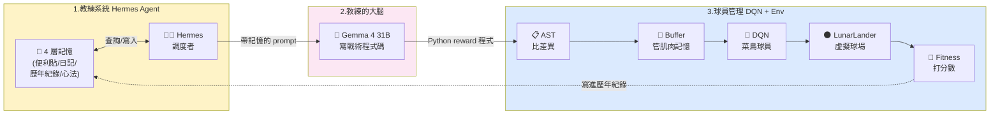
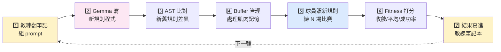

# Hermes-DQN 白話架構介紹

> 用比喻看懂這個專案在幹嘛 ── 不需要 DRL 背景。

---

## 🎯 30 秒看完

> **用一個會記得過去經驗的 AI 教練,自動寫「該怎麼得分」的規則,交給 AI 球員去練習。
> 球員越練越強,而且不用真人花時間調規則。**

---

## 🏀 主比喻:這個專案像在訓練一支籃球隊

想像你今天要訓練一支籃球隊,但你**不親自下場**,而是:

- 你有一個**很厲害的 AI 教練**
- AI 教練有一本**永遠不會忘記的筆記本**
- 你要訓練的是**一個只會照規則打球的菜鳥球員**

**訓練的流程是這樣**:

1. 教練翻筆記本看「上次叫球員怎麼打」「結果如何」
2. 想出一個新戰術
3. 寫成一份明確的「得分規則」交給球員
4. 球員照規則打一場比賽
5. 看比賽結果好不好
6. 把結果寫進筆記本
7. 回到第 1 步,但這次教練多了一筆紀錄

這個專案,就是把上面這個循環**全部自動化**。

---

## ❗ 為什麼要做這件事:三個很實際的痛點

### 痛點 1:不知道該叫球員「怎麼算得分」

DRL(深度強化學習)裡,程式能不能學會,**很看「該得幾分」這條規則寫得好不好**。
這條規則叫 **reward function**(獎勵函數)。但寫好它非常難。

**比喻**:你叫小朋友打籃球,如果規則只是「進球得分」,他可能會學會抱著球跑去終點;
但如果規則是「進球 +10、出界 −1、雙手運球 −5」,他學得快很多。
**問題是這條規則對每個任務都不一樣,人工調很累。**

2024 年 EUREKA 論文證明了:**人工寫的規則,有 83% 的任務輸給 LLM 寫的,平均效能落後 52%。**

### 痛點 2:用 GPT-4 寫規則太貴

EUREKA 用 GPT-4 ── 好用沒錯,但要錢、要連網、研究無法重現。

**比喻**:有錢的球隊可以請奧運級總教練,但學生實驗室負擔不起。

### 痛點 3:教練每次都從零開始想

普通 LLM 每次對話是獨立的,**記不住上次叫球員怎麼打**。
所以每次都重新想戰術,既慢又會重複犯錯。

**比喻**:今天的你完全不記得昨天訓練做過什麼。

### 額外痛點:換戰術會把球員搞混

球員會根據**過去的練習記憶**來打球(技術名詞:replay buffer)。
如果規則換了,**舊的肌肉記憶會干擾新戰術**。學界叫這個現象「災難性遺忘」(catastrophic forgetting)。

**比喻**:你練熟了「投三分 +3 分」,結果突然改成「投三分 −1 分」,
但你身體還記得舊規則,會繼續猛投三分,反而扣分。

---

## 🧩 三大子系統:球隊的三個角色

對應 README 那張架構圖的三個區塊。

### 1️⃣ 教練系統 (Hermes Agent) ── 拿筆記本想戰術的人

**這個角色不負責真的想戰術細節**,負責**翻筆記本 + 整理結果 + 找下一個方向**。

它有一本**四層的筆記本**,因為不同類型的資訊查詢需求不一樣:

| 筆記本層級 | 比喻 | 存什麼 |
|---|---|---|
| **Short Context** | 桌上的便利貼 | 這一輪正在想的事 |
| **Working Memory** | 今天的訓練日記 | 這個 session 的思路 |
| **SQLite FTS5** | 整本厚厚的歷年紀錄 | 過去所有「規則 → 結果」對照 |
| **Procedural Memory** | 教練的執教心法手冊 | 固化下來的經驗法則 |

**為什麼分四層?**
就像你不會把「等一下吃什麼午餐」記進年度履歷 ── 短期 / 長期、結構化 / 非結構化的東西,
查詢方式根本不同,混在一起會變得**又慢又雜訊多**。

### 2️⃣ 教練的大腦 (Google Gemma 4 31B) ── 真正想戰術細節的人

**角色**:接收 Hermes 整理好的 prompt,**寫出實際的得分規則程式碼**。

我們用 Google 開源的 **Gemma 4 31B**,而不是 GPT-4。
理由:免費、可離線、研究可重現,而且寫程式能力很強(Codeforces ELO 2150,跟人類中上水準的程式競賽選手差不多)。

**比喻**:Hermes 是球隊的**策略部主管**,Gemma 是被請來「實際畫戰術圖」的人。
Hermes 跟 Gemma 說「上場時要強化油門控制」,Gemma 真的寫出
「每秒踩油門超過 0.5 秒 −2 分」這種**具體的 Python 程式碼**。

### 3️⃣ 球員管理 (DQN + Env) ── 上場練習的人

**角色**:拿到教練給的規則,在虛擬球場上真的「練」很多場比賽。

包含這些零件:

| 零件 | 白話翻譯 |
|---|---|
| **DQN 模型** | 照規則學打球的菜鳥球員(神經網路) |
| **Gymnasium LunarLander-v3** | 虛擬球場 ── 雖然叫月球登陸器,但本質就是一個有規則的小遊戲 |
| **AST 管理器** | **比對「新規則」和「上次規則」差在哪**(AST = 程式碼結構樹) |
| **Buffer 管理器** | 看 AST 結果,決定球員的肌肉記憶**該保留、該衰減、還是清空** |
| **Fitness 評估** | 給這場訓練打分數(收斂幾輪、平均得分、成功率) |

**AST 管理器的比喻**:
就像你拿新舊兩本戰術手冊比對 ──
**有些段落是新加的、有些只改了標點符號、有些被刪掉**。
AST 就是「程式版的文件比對工具」,把這些差異攤開來看。

**Buffer 管理器的比喻**:
- 規則只改標點 → 肌肉記憶**保留**(舊經驗仍然有用)
- 規則改了得分標準 → 肌肉記憶**權重打折**(舊經驗還能參考)
- 規則完全反過來 → **清空**(從頭來,不然會被舊記憶誤導)

---

## 🏗️ 靜態架構圖:三個角色怎麼相處



如果你看不到圖,文字版:

```
[教練系統 + 4 層記憶] ──prompt──> [Gemma 大腦] ──寫出 reward──>
                                                              ↓
       ┌─寫回記憶─ [Fitness] <── [DQN 球員 + 球場] <── [Buffer 管理] <── [AST 比對]
       │
       └──> 下一輪用更厚的筆記本想戰術
```

---

## 🔄 動態流程圖:7 步閉環



### 每一步在做什麼

| 步驟 | 誰做 | 做什麼 | 為什麼重要 |
|---|---|---|---|
| 1 | Hermes 教練 | 翻筆記:「上次叫球員多踩油門 → 墜機」 | 不從零開始想 |
| 2 | Gemma 大腦 | 寫 Python:「踩油門 −0.5 分」 | 真正產出可執行規則 |
| 3 | AST 管理器 | 比對:「只差『懲罰係數 −0.3 → −0.5』」 | 知道規則改多大 |
| 4 | Buffer 管理器 | 「改動小 → 保留 80% 舊經驗」 | 不浪費已學到的東西 |
| 5 | DQN 球員 | 照新規則練 200 場 | 真的去學習 |
| 6 | Fitness 評估 | 「平均分 +143,比上次進步」 | 用數字評斷 |
| 7 | Hermes 教練 | 寫進 SQLite:「−0.5 → 效果好」 | 下次想戰術會記得 |

**七步一直循環,每跑一輪,教練的筆記本就更厚一些**,
下一輪寫的規則就更接近最佳解 ── 這就是為什麼這個系統會「越用越聰明」。

---

## 📚 技術術語的白話翻譯表

學弟妹接手或口試被問時可以查這張表。

| 學術名詞 | 白話翻譯 | 在這個專案裡指什麼 |
|---|---|---|
| Reward Function | 得分規則 | Gemma 寫的 Python 函式,決定球員每一步該得幾分 |
| Replay Buffer | 球員的肌肉記憶 | 球員過去打球的經驗,用來訓練 |
| Catastrophic Forgetting | 災難性遺忘 | 換戰術後舊肌肉記憶反而干擾新打法 |
| AST (Abstract Syntax Tree) | 程式碼結構樹 | 把兩份程式拆成樹狀比對,看差在哪 |
| Fitness | 成績單 | 一場訓練跑完的綜合評分 |
| Convergence | 學會了 | 球員的平均得分連續 100 場都過及格線 |
| ε-greedy | 探索 vs 經驗的拿捏 | 球員有時候照經驗打,有時候隨機嘗試新動作 |
| Q-Network | 球員的腦 | 一個神經網路,輸入球場狀態 → 輸出該做什麼動作 |
| Target Network | 球員的「穩定參考版」 | 訓練時用一個比較慢更新的版本當靶,避免抖動 |

---

## 🏛️ 為什麼這個專案叫 Hermes-DQN

- **Hermes** 是希臘神話的**信使之神**,負責在神和人之間傳訊。
  在這個專案裡,Hermes Agent 也是個信使 ── **在 Gemma 大腦、記憶筆記本、和 DQN 球員之間傳訊**。
- 我們用的記憶架構是 **Nous Research** 公司在 2026 開源的 **Hermes Agent 框架**,所以名字就沿用了。
- **DQN = Deep Q-Network**,2013 年 DeepMind 提出的經典 DRL 演算法,圍棋 AlphaGo 的「祖先」。

**Hermes-DQN = 用 Hermes 記憶架構,自動幫 DQN 找出好的訓練規則。**

---

## 🥊 跟其他研究的差別

| | 別人怎麼做 | 我們怎麼做 |
|---|---|---|
| **誰寫 reward** | EUREKA 用 GPT-4 ── 貴、要連網 | 用 Gemma 4 31B ── 免費、可離線 |
| **教練有沒有記憶** | 一般 LLM agent ── 沒記憶,重複試錯 | 四層記憶 ── 不重複犯錯 |
| **戰術換了怎麼辦** | 傳統 DQN ── 災難性遺忘 | AST + Buffer 管理 ── 保留有用經驗 |

---

## 🛠️ 開發環境怎麼準備

### 比喻:幫教練蓋一座訓練場

你不能空手訓練球員。**球場 + 物理引擎 + 球員的身體 + 計分板 + 教練的辦公室** ── 這些就是「開發環境」。
一次蓋好,之後寫程式才不會卡在「啊我電腦沒裝這個」。

### 核心套件(已經裝好、目前在跑)

對應在 `requirements.txt` 裡的五個套件:

| 套件 | 版本 | 在訓練場扮演什麼 | 為什麼選它 |
|---|---|---|---|
| **PyTorch** | `~=2.5.0` | 🤾 球員的身體與神經 | DQN 神經網路用它寫最直觀,GPU 支援成熟 |
| **Gymnasium** | `~=1.0` | 🌑 虛擬球場 | RL 標準環境框架,API 穩定 |
| **Box2D** | (Gymnasium 帶入) | ⚙️ 球場的物理引擎 | 計算重力、碰撞、推進力 |
| **NumPy** | `~=2.0` | 📊 計分板的計算機 | 大量數字運算的底層 |
| **tqdm** | `~=4.66` | ⏱️ 訓練進度條 | 看訓練還剩多久 |

### 後續階段才需要的套件(對應四個未來 change)

各自子系統的擁有者實作時再裝,不用一次全裝。

| 套件 | 角色比喻 | 用途 | 哪個 change 會用 |
|---|---|---|---|
| **google-genai** | 🧠 教練的腦 | Google AI Studio API client,送 prompt 給 Gemma 4 31B | `gemma-reward-generator` |
| **sqlite3**(Python 內建) | 📒 教練的歷年紀錄本 | FTS5 全文檢索,長期記憶儲存 | `hermes-memory-layer` |
| **pydantic** | 🗂️ 筆記本的固定欄位 | 記憶條目的格式驗證,避免亂寫 | `hermes-memory-layer` |
| **ast**(Python 內建) | 📋 戰術手冊比對工具 | 分析新舊 reward 程式碼結構差異 | `ast-buffer-manager` |
| **python-dotenv** | 🔐 API key 保管箱 | 把 Gemma 金鑰放 `.env`,不要進 git | `gemma-reward-generator` |
| **matplotlib** | 📈 訓練曲線畫筆 | 把 `episodes.jsonl` 畫成 reward over time 圖 | `closed-loop-fitness` |
| **pandas**(可選) | 📊 跨輪實驗彙整 | 多輪 fitness 結果做成表格 | `closed-loop-fitness` |
| **pytest** | 🧪 自動化測試 | 已在 `pyproject.toml [project.optional-dependencies.dev]` | 全部 |
| **ruff** | 🧹 程式碼風格清潔工 | 自動格式化、抓髒程式碼 | 全部 |

### GPU vs CPU:你不用煩惱,程式會自己選

下面這行已經寫在 `DQNAgent` 裡:

```python
device = "cuda" if torch.cuda.is_available() else "cpu"
```

**有 GPU 就用 GPU,沒有就退 CPU,你不用改任何一行程式。**

| 你的設備 | 1500 ep 訓練時間估算 |
|---|---|
| NVIDIA GPU + CUDA 12.x(已驗證 cu121) | 約 20-30 分鐘 |
| CPU only(Intel / AMD) | 約 60-90 分鐘 |
| Mac M 系列(MPS 支援尚未穩) | 用 CPU 模式,約 60-90 分鐘 |

### IDE / 編輯器建議

| 工具 | 為什麼 |
|---|---|
| **VS Code** | 整合 Python / Git / 終端機 / Jupyter / Markdown 預覽,最通用 |
| └ Python(微軟官方擴充) | 執行 / 偵錯 Python |
| └ Pylance | 型別檢查,提早抓 bug |
| └ Ruff | 自動格式化、抓髒程式碼 |
| └ Markdown Preview Mermaid Support | 預覽本檔的流程圖 |

**團隊統一一套會省下很多溝通成本** ── 不然 PR 裡每次都有 IDE 自動加的格式 diff。

### 一次裝好的安裝流程(Windows 11 + Python 3.11 已驗證)

```bash
# 1. 建獨立的虛擬環境(避免污染系統 Python)
python -m venv .venv
.venv\Scripts\activate          # Windows PowerShell
# source .venv/bin/activate     # macOS / Linux

# 2. 安裝專案 + 所有相依套件
pip install -e .

# 3. 驗證:跑 10 集 smoke test(< 1 秒)
python -m hermes_dqn.training.train --episodes 10 --seed 42
```

看到 `[OK] Run complete. Artifacts written to: runs\...` 就代表環境 OK。
產出的 `runs/<時間戳>/episodes.jsonl` 是 10 行 JSON,每行一集訓練結果。

### Gemma API key 怎麼放

到時候做 `gemma-reward-generator` 時會用 Google AI Studio 的 API key。流程:

1. 到 <https://aistudio.google.com/app/apikey> 申請 key
2. 在專案根目錄建 `.env`(已在 `.gitignore` 排除,不會 commit 進 git)
3. 內容:
   ```
   GOOGLE_API_KEY=AIza...你的金鑰...
   ```
4. 程式裡用 `python-dotenv` 載入,**永遠不要把金鑰寫進 Python 原始碼**

---

## 🧱 實作建議:從哪面牆開始砌?

### 比喻:蓋房子要先蓋承重牆

不能從「裝飾性的窗台」開始砌。**先蓋承重結構,確認房子站得住,再加細節。**

對應這個專案:✅ 已蓋好可訓練的 DQN 底盤,接下來依序加 Gemma → 記憶 → AST → 整合。

### 五份 OpenSpec change 的順序與分工(四人版)

| # | Change 名 | 對應子系統 | 適合誰寫 | 預估工時 | 狀態 |
|---|---|---|---|---|---|
| 1 | `bootstrap-dqn-baseline` | DQN baseline + reward 介面 + fitness | 任一人(本次已做) | 1 天 | ✅ 已完成 |
| 2 | `gemma-reward-generator` | 教練的大腦(Gemma API + 程式碼生成) | 會寫 API client 的人 | 2-3 天 | ⏳ 待開 |
| 3 | `hermes-memory-layer` | 教練的 4 層筆記本(SQLite FTS5 為主) | 熟 SQLite / 資料模型的人 | 3-5 天 | ⏳ 待開 |
| 4 | `ast-buffer-manager` | AST 分析 + replay buffer 處理 | 熟 Python 演算法 / AST 的人 | 3-4 天 | ⏳ 待開 |
| 5 | `closed-loop-fitness` | 7 步閉環整合 + 跑實驗 + 寫論文 | 整合能力 + 寫作能力強 | 持續到 demo 日 | ⏳ 待開 |

### 為什麼是這個順序?(每步都是獨立可發表的命題)

每一個 change 結束時,都能**獨立講出一個命題,而不必等全部做完**。對課程報告很重要 ── 隨時中止都有東西可以報。

1. **② Gemma 先做** ── 證明「LLM 寫的 reward 比手寫的好」(EUREKA 命題用開源模型重現一次)
2. **③ 記憶加上去** ── 證明「有記憶的 LLM,比沒記憶的更快收斂」(我們的新貢獻)
3. **④ AST/Buffer** ── 證明「換 reward 時保留有用經驗,比每次清空更好」(對應災難性遺忘)
4. **⑤ 整合** ── 把三個命題串起來,跑大量實驗,寫論文與簡報

### 每個 change 的 MVP(最小可用版本)

**不要一開始就追求完美。先做能跑的最小版,再加複雜度。**

#### ② `gemma-reward-generator` MVP

- 寫 `LLMRewardClient(api_key)`:輸入「任務描述字串 + 上次結果」→ 輸出「Python reward 程式碼字串」
- 用 `compile()` + 受控的 `exec()` 把字串變成 callable
- 包成 `RewardFunction` 介面(已在 baseline 定好,直接套)
- **驗收**:能跑通「Gemma 寫 reward → 訓練 1500 ep → 得 fitness 報告」一次

#### ③ `hermes-memory-layer` MVP

- 先做最重要的「SQLite FTS5 長期記憶」這一層,其他三層後補
- Schema 範例:`(id, timestamp, reward_code, fitness_metrics, lessons_learned)`
- 提供 `MemoryStore.write(entry)` 與 `MemoryStore.search(query, top_k=5)`
- **驗收**:能從歷史紀錄查到「過去高 fitness 的 reward」並組進 Gemma 的 prompt

#### ④ `ast-buffer-manager` MVP

- 用 Python 內建 `ast` 做 diff
- 至少分三類差異:`rename` / `number-change` / `structural-change`
- 對應三種 Buffer 動作:`keep` / `decay-weights` / `clear`
- **驗收**:同球員先用 reward A 訓 500 ep,再換 reward B 訓 500 ep,
  「有 Buffer 管理」要比「不管理(直接清空)」更快收斂

#### ⑤ `closed-loop-fitness` MVP

- 先做「**3 輪閉環**」 ── 不是「跑到收斂為止」,先證明會「越學越好」
- 畫出第一張「fitness 隨 LLM 迭代上升」的圖
- 寫成論文 Section 4 初稿

### 接縫先談妥,再各自開工(避免撞車)

四個子系統之間的**介面(interface)**,一定要在 spec 階段就寫死:

```python
# 接縫 1:reward function 簽章 ── 已定(bootstrap-dqn-baseline)
def reward_fn(obs, action, next_obs, env_reward, terminated, truncated, info) -> float


# 接縫 2:Gemma client ── gemma-reward-generator 要定
class LLMRewardClient:
    def generate(self, task_desc: str, memory: list["MemoryEntry"]) -> str:
        """Returns Python source code that defines a reward_fn."""


# 接縫 3:記憶條目 ── hermes-memory-layer 要定
@dataclass
class MemoryEntry:
    reward_code: str
    fitness: FitnessReport      # 已在 baseline 定好
    notes: str


# 接縫 4:Buffer 管理動作 ── ast-buffer-manager 要定
class BufferAction(Enum):
    KEEP = "keep"
    DECAY = "decay"
    CLEAR = "clear"
```

**口訣**:介面定義 → 各自開分支 → 各自寫完 → PR review → 合進 main。

### Git 分支策略

- `main` 是「永遠跑得起來的版本」(目前是已驗證的 baseline)
- 每個 change 開自己的 feature branch:`change/gemma-reward-generator`、`change/hermes-memory-layer`...
- PR 合進 `main` 前必須:
  1. `openspec validate <change> --strict` 通過
  2. 至少一個**非 owner** 的 reviewer LGTM
  3. spec 的每個 scenario 都有對應證據(測試 / log / 截圖)
- 如果你改的範圍**踩到別人 change 的地盤** → 先在群組講一聲,不要直接 push

### 每日工作流程(已寫好的 npm script)

```bash
npm run dev:start    # 開工:git pull + openspec init + 讀最新 handover
# ... 寫程式 ...
npm run dev:ending   # 收工:寫 NN-handover.md + commit + push
```

`handover` 是異步協作的關鍵 ── 隊友打開電腦不用問你,讀最新 handover 就接得上。

---

## 🎤 一句話收尾(口試版)

> **讓 AI 教練自己翻筆記想戰術、叫 AI 大腦寫程式、給 AI 球員照著練,
> 還會聰明處理球員的肌肉記憶 ── 這就是 Hermes-DQN。**

---

## 🔗 想看更技術的版本

- **正式架構與數據動機**:[README.md](README.md)
- **系統架構圖(視覺版)**:[images/第二版架構圖.png](images/第二版架構圖.png)
- **論文**:[docx/](docx/) 裡的「第二版」PDF
- **進行中的實作**:[openspec/changes/](openspec/changes/)
